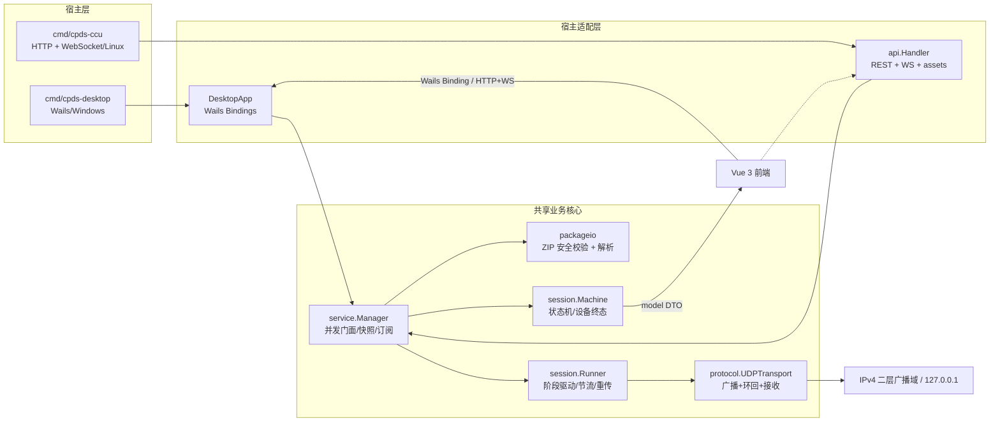
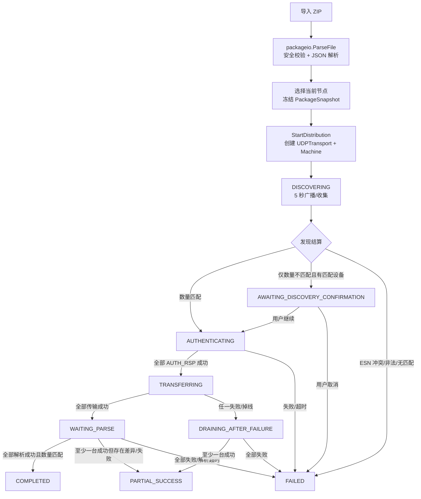
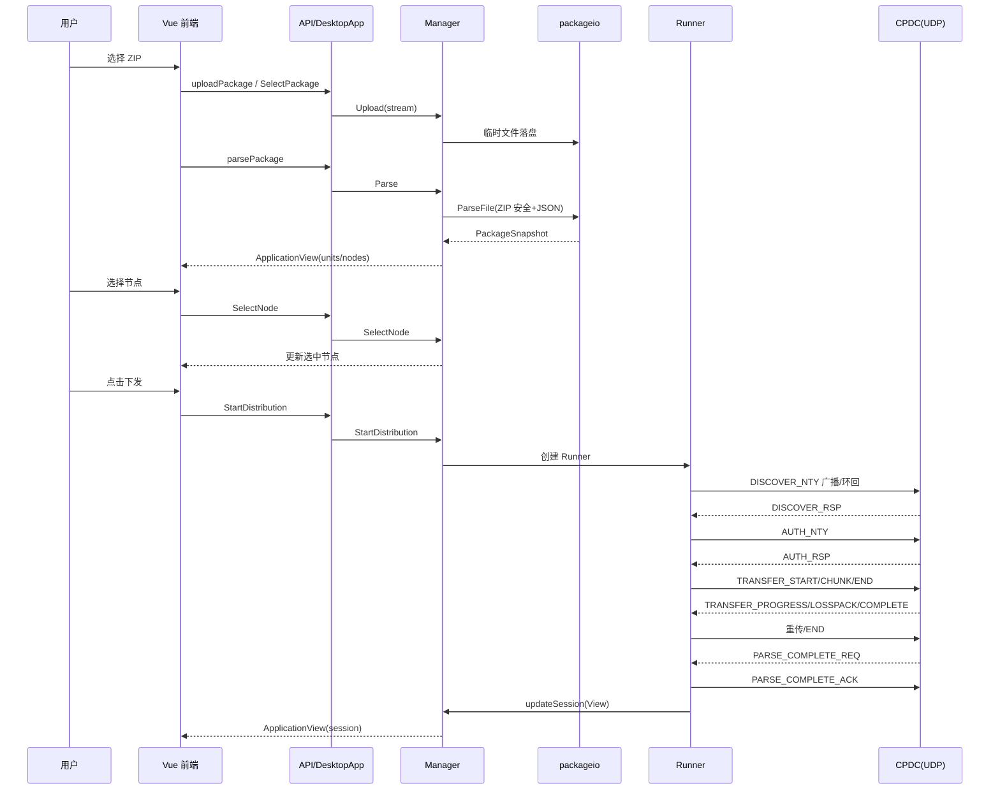
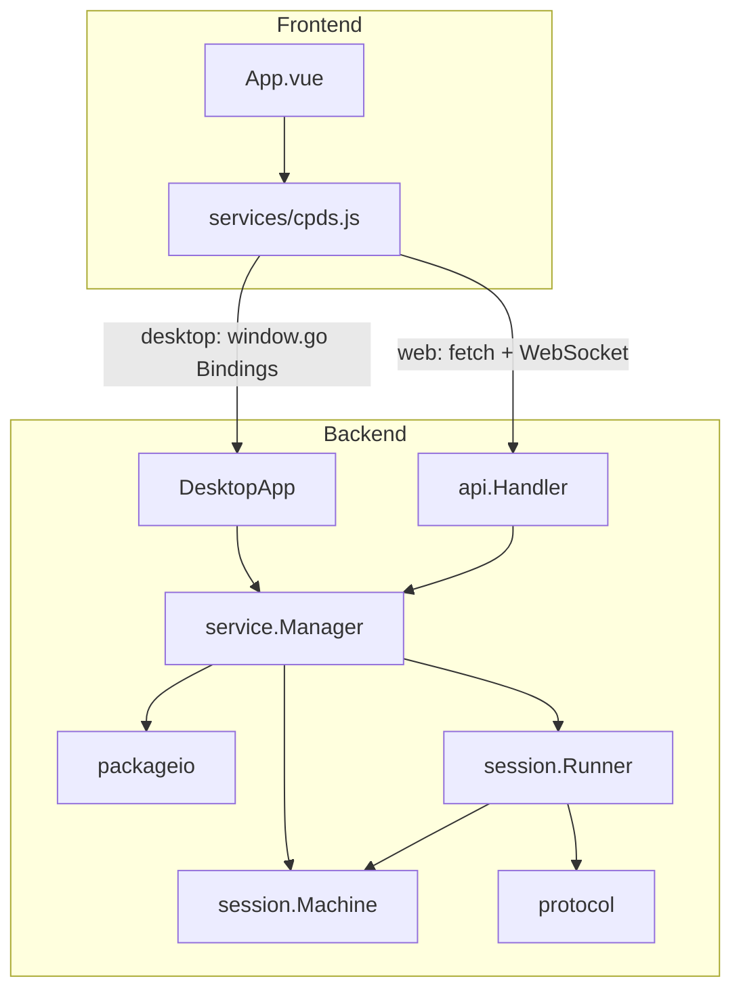

# CPDS 项目研读报告

> 文档版本：1.0  
> 生成日期：2026-08-17  
> 分析模式：AI 系统分析师 / 自顶向下 + 由外到内  
> 代码基线：`D:\work\flutter\template\3-38-10\CPDS-main`

## 目录

- [1. 执行摘要与研读计划](#1-执行摘要与研读计划)
- [2. 项目概览报告](#2-项目概览报告)
- [3. 结构化分析文档](#3-结构化分析文档)
- [4. 问题与建议清单](#4-问题与建议清单)
- [5. 二次开发指南](#5-二次开发指南)
- [6. 知识图谱](#6-知识图谱)
- [7. 总体评价](#7-总体评价)

## 1. 执行摘要与研读计划

### 1.1 一句话定位

CPDS（Communication Plan Distribution Server）是一个面向可信二层广播域内的“通信保障配置包下发”工具：以 Go 提供 ZIP 解析、UDP 发现/认证/传输/解析状态机，以 Vue 3 提供桌面与浏览器两套界面，发布为 Windows/Wails 桌面程序 `CPD.exe` 与 Linux/amd64 Web 服务 `CPDS-CCU`。

### 1.2 研读计划与实际耗时

| 阶段 | 内容 | 预估占比 | 实际起止 | 结论 |
|---|---|---:|---|---|
| 1 | 项目概览 | 10% | 17:10–17:11 | README、目录、依赖初判完成 |
| 2 | 构建与配置 | 15% | 17:11–17:12 | wails.json、go.mod、Vite、构建脚本完成 |
| 3 | 后端深度剖析 | 30% | 17:12–17:15 | 入口、Manager、状态机、Runner、packageio、protocol 完成 |
| 4 | 前端深度剖析 | 25% | 17:15–17:16 | App、组件、服务适配、i18n、RTL 完成 |
| 5 | Wails 特有机制 | 10% | 17:16 | 绑定、窗口、embed、跨平台完成 |
| 6 | 跨层评估与输出 | 10% | 17:16–17:17 | 数据流、风险清单、交付文档完成 |

实际验证结果：

- `go test ./...` 通过，其中 `cpds/tests` 用时约 3.009s。
- `go vet ./...` 通过。
- `npm test` 未通过，当前 `frontend/node_modules` 缺少 `@rolldown/binding-win32-x64-msvc` 原生绑定。
- `go test -race ./...` 因 `cmd` 包在当前 Windows/race 构建环境下 setup failed，未完成竞态验证。

## 2. 项目概览报告

### 2.1 技术栈

| 层 | 技术 | 版本/说明 |
|---|---|---|
| 后端语言 | Go | `go.mod` 声明 `go 1.25.0`，本机 `go1.25.5 windows/amd64` |
| UDP 协议 | Proto3 + Magic | 本项目 `proto/cpd.proto`，生成代码位于 `gen/cpd/v1` |
| 实时通道 | gorilla/websocket | `v1.5.3`，仅 CCU Web 使用 |
| 桌面外壳 | Wails v2 | `v2.12.0`，Windows/amd64 |
| 前端框架 | Vue 3 | `3.5.40`，Composition API |
| 国际化 | vue-i18n | `11.4.6`，`zh-CN`/`en-US`/`ar-SA` |
| 前端构建 | Vite | `8.1.5`（依赖 Rolldown） |
| 前端测试 | Vitest | `4.1.10`，`@vue/test-utils 2.4.11`，`jsdom 28.0.0` |
| Go 测试 | 标准库 `testing` | 所有测试集中在 `tests/` |

### 2.2 顶层目录结构

```text
CPDS/
├─ cmd/
│  ├─ cpds-ccu/           # Linux/amd64 Web 服务入口
│  └─ cpds-desktop/       # Windows/amd64 Wails 入口
├─ gen/cpd/v1/            # proto/cpd.proto 生成的 Go 类型
├─ internal/
│  ├─ api/                # HTTP / WebSocket / 静态资源门面
│  ├─ model/              # 前后端 DTO 与业务模型
│  ├─ packageio/          # 上传、ZIP 安全校验、JSON 解析
│  ├─ protocol/           # Magic、UDP、网卡、分包、时间参数
│  ├─ session/            # Distribution 状态机与 Runner
│  ├─ service/            # Manager，跨宿主共用业务门面
│  ├─ platform/           # 磁盘剩余空间等宿主能力
│  └─ logging/            # 日志初始化与脱敏工具
├─ frontend/              # Vue 3 源码与 embed 资产
├─ proto/cpd.proto        # 协议唯一基线
├─ tests/                 # 全部 Go/Vitest 测试
├─ docs/                  # 需求、设计、计划
└─ build/                 # 图标、构建脚本
```

### 2.3 顶层模块关系



### 2.4 关键业务实体

| 实体 | 位置 | 说明 |
|---|---|---|
| `PackageSnapshot` | `internal/model/model.go` | 不可变上传包快照：文件名、路径、大小、SHA-256、解压大小、工作空间、单位树、节点、设备 |
| `ApplicationView` | `internal/model/model.go` | 前端统一状态视图：上传、包、选中节点、可下发、会话 |
| `SessionView` | `internal/model/model.go` | 会话视图：sessionId、activeState、设备状态、失败明细、发送进度 |
| `Failure` | `internal/model/model.go` | 结构化失败：stage/deviceType/esnSuffix/deviceId/errorCode/params |
| `DiscoveredClient` | `internal/session/machine.go` | 发现阶段 CPDC 实例：ESN、nonce、类型、IP、掩码 |
| `clientState` | `internal/session/machine.go` | 每个 ESN 客户端的认证/传输/解析终态与计时 |

### 2.5 核心流程



## 3. 结构化分析文档

### 3.1 目录结构解析

| 目录 | 职责 | 关键说明 |
|---|---|---|
| `cmd/cpds-ccu` | Linux Web 服务入口 | 解析 `--listen`，默认 `0.0.0.0:18080`；创建 Manager、HTTP Server、优雅关闭 |
| `cmd/cpds-desktop` | Windows Wails 入口 | `wails.Run`，Frameless，注入 `DesktopApp`，处理启动/关闭 |
| `internal/api` | HTTP/WS/静态资源 | 注册 8 个路由，WebSocket 推送状态，嵌入式前端资源 |
| `internal/service` | 跨宿主业务门面 | Manager 维护锁、订阅、上传/解析/选择/下发/决策 |
| `internal/session` | 状态机与运行器 | Machine 负责业务规则和终态，Runner 负责阶段时序、UDP 收发和节流 |
| `internal/protocol` | UDP 协议/网络 | Magic、信封、UUID、分片、认证分包、网卡枚举、fanout |
| `internal/packageio` | 包解析与安全 | ZIP 全包校验、路径安全、JSON 类型映射、空间估算 |
| `internal/model` | DTO/错误模型 | `ErrorCode + params` 结构化错误，前后端稳定契约 |
| `internal/platform` | 平台差异 | Windows `GetDiskFreeSpaceEx` / Unix `Statfs` |
| `internal/logging` | 日志 | `slog` JSON 输出到 stdout+`cpds.log`，提供 `Redact` |
| `frontend/src` | Vue 页面 | 组件化 Figma 页面、服务适配、i18n、RTL |
| `tests` | 测试 | Go 状态机/协议/解析/API，Vitest 组件/i18n/网卡 |
| `proto` | 协议基线 | 12 类消息，Proto3 + 4 字节 Magic |

### 3.2 配置解析

#### `wails.json`

- `name: CPDS`，`outputfilename: CPD`。
- `frontend:install/build/dev:watcher` 分别指向 `npm install`、`npm run build`、`npm run dev`。
- `frontend:dir: frontend`。
- 未配置版本、证书、icon 路径等，图标通过 Windows 资源文件提供。

#### `go.mod`

直接依赖：

| 依赖 | 用途 | 成熟度/备注 |
|---|---|---|
| `github.com/gorilla/websocket v1.5.3` | CCU 实时状态通道 | 成熟稳定 |
| `github.com/wailsapp/wails/v2 v2.12.0` | 桌面外壳 | 官方维护 |
| `golang.org/x/sys v0.47.0` | 系统调用、广播、磁盘空间 | 官方扩展库 |
| `google.golang.org/protobuf v1.36.11` | Proto3 编解码 | 官方实现 |

间接依赖主要来自 Wails 生态（echo、go-toast、webview2、uuid 等），未发现明显高危或不合理项。

#### `frontend/package.json`

运行时依赖仅 `vue` 与 `vue-i18n`，全局状态和路由未引入额外框架。开发依赖使用精确版本，Vite 8 / Vitest 4 较新；当前本机 `node_modules` 缺少 Rolldown Windows 原生绑定，见问题清单。

#### `frontend/vite.config.js`

- `@vitejs/plugin-vue`。
- 通过 `define` 注入 `__CPD_VERSION__`，由 `productVersion.js` 从根目录 `version.json` 读取并强校验四段式格式。
- `@` 别名指向 `src`。
- `build.outDir: dist`。
- 未配置 dev proxy、多页入口或 CDN 优化，符合当前规模。

#### 构建与发布脚本

- `build/scripts/build.ps1`：先 `npm ci`、`npm test`、`npm run build`，再 `go test ./...`，分别产出 `CPD.exe`（`windows/amd64`）和 `CPDS-CCU`（`linux/amd64`，`CGO_ENABLED=0`）。
- `build/scripts/test.ps1`：前端测试+构建，后端 `go test` + `go vet`。
- `build/scripts/build.bat`：调用 PowerShell 脚本的批处理入口。
- 未发现 Dockerfile 或 CI/CD 配置，部署流程主要由脚本承担。

### 3.3 后端核心逻辑

#### 3.3.1 Wails 绑定方法

以下方法定义在 [app_windows.go](D:/work/flutter/template/3-38-10/CPDS-main/cmd/cpds-desktop/app_windows.go)。

| 方法 | 输入 | 输出 | 说明 |
|---|---|---|---|
| `GetState()` | - | `model.ApplicationView` | 读取当前快照 |
| `SelectPackage()` | - | `model.DesktopResult` | 打开 ZIP 文件选择器并上传 |
| `ParsePackage()` | - | `model.DesktopResult` | 解析已上传包 |
| `SelectNode(nodeID)` | `string` | `model.DesktopResult` | 选择当前节点 |
| `ListNetworkInterfaces()` | - | `[]protocol.InterfaceInfo, error` | 枚举有线网卡 |
| `SelectNetworkInterface(name)` | `string` | `model.DesktopResult` | 设置业务网卡 |
| `StartDistribution()` | - | `model.DesktopResult` | 开始下发 |
| `ResolveDiscoveryMismatch(sessionID, proceed)` | `string, bool` | `model.DesktopResult` | 发现数量不匹配决策 |
| `WindowMinimize()` | - | - | 最小化 |
| `WindowToggleMaximize()` | - | - | 最大化/还原 |
| `WindowClose()` | - | `bool` | 尝试关闭；活动会话返回 false |

#### 3.3.2 HTTP API

定义于 [handler.go](D:/work/flutter/template/3-38-10/CPDS-main/internal/api/handler.go:27)。

| 方法/路径 | 作用 | 主要错误码 |
|---|---|---|
| `GET /api/state` | 获取应用状态 | - |
| `POST /api/package/upload` | 上传 ZIP | `PACKAGE_TOO_LARGE`、`INVALID_PACKAGE`、`STORAGE_IO_ERROR`、`BUSY` |
| `POST /api/package/parse` | 解析包 | 同上传及 `INVALID_ZIP_SIZE`、`INSUFFICIENT_STORAGE` |
| `POST /api/nodes/select` | 选择节点 | `INVALID_MESSAGE`、`INVALID_PACKAGE`、`BUSY` |
| `POST /api/distributions` | 开始下发 | `BUSY`、`INVALID_PACKAGE`、`NETWORK_INTERFACE_ERROR` |
| `POST /api/distributions/decision` | 发现不匹配决策 | `INVALID_MESSAGE`、`BUSY` |
| `GET /api/events` | WebSocket 状态流 | - |
| `/` | 嵌入式前端资源 | - |

错误响应统一为：

```json
{ "errorCode": "ERROR_CODE_...", "params": { } }
```

#### 3.3.3 会话状态机

前端可见 `activeState` 稳定枚举：

`IDLE`、`DISCOVERING`、`AWAITING_DISCOVERY_CONFIRMATION`、`AUTHENTICATING`、`TRANSFERRING`、`WAITING_PARSE`、`DRAINING_AFTER_FAILURE`、`COMPLETED`、`PARTIAL_SUCCESS`、`FAILED`。

关键规则：

- 同一进程同时只允许一个活动 Distribution。
- 下发开始前冻结 `PackageSnapshot`、节点、设备清单。
- 发现/认证失败立即终态；传输/解析失败进入排空语义，继续处理其他非终态设备。
- 设备终态不可被迟到报文改写；重复最终请求仍 ACK。
- 超时集中在 `internal/protocol/timing.go`：发现 5s、认证 5s、传输静默 10s、无进展 30s、解析等待 35s。

#### 3.3.4 并发模型

- `Manager` 使用 `sync.RWMutex` 保护共享状态，通过 `notify()` 向订阅 channel 推送最新快照。
- `Runner` 启动 `receive` goroutine 和内部 `in/err` channel，主流程以 select 驱动阶段。
- `UDPTransport` 使用 `sync.Once` 关闭、`sync.Mutex` 保护告警去重。
- 主要并发风险点在 Manager 的耗时 IO 与最终状态提交之间存在锁间隙，见问题清单。

#### 3.3.5 数据持久化与日志

- 临时上传文件位于可执行文件同级 `runtime/uploads/`，随机命名。
- 日志位于 `runtime/cpds.log`，`slog` JSON，权限 `0600`。
- 日志工具 `Redact` 已实现但未接入生产日志路径。

### 3.4 前端核心页面

项目不使用 Vue Router，页面由根组件 `App.vue` 和 `Dashboard.vue` 组装。状态由后端 `ApplicationView` 快照驱动，前端没有 Pinia/Vuex。

| 组件 | 职责 | 状态/通信依赖 |
|---|---|---|
| `App.vue` | 根状态、操作分发、生命周期 | `cpds.getState/subscribe`、网卡初始化 |
| `Dashboard.vue` | 布局与弹窗编排 | `state`、`networkInterface` |
| `TopBar.vue` | 品牌、版本、语言、窗口控制 | `__CPD_VERSION__`、i18n |
| `SideNav.vue` | 左侧菜单（仅“参数加注”） | i18n |
| `PackagePanel.vue` | 文件导入、解析、节点树 | `state.upload/package` |
| `NodeTreeBranch.vue` | 递归单位/节点树 | `nodesById`、选中节点 |
| `DevicePanel.vue` | 右侧设备分组、阶段条、进度 | `state.session`、i18n |
| `NetworkInterfaceBar.vue` | Windows 业务网卡选择/刷新/下发 | `networkInterface` |
| `StatusBadge.vue` / `ProgressBar.vue` | 状态/进度展示 | props |
| `DiscoveryMismatchDialog.vue` | 发现数量不匹配决策 | `state.session.failures` |
| `FailureDialog.vue` | 最终成功/部分成功/失败弹窗 | `failures`、`devices` |
| `NoticeDialog.vue` | 关闭拦截等提示 | i18n |
| `LanguageMenu.vue` | 三语切换 | i18n |

### 3.5 通信协议

#### Binding 与 Events

- Windows：前端通过 Wails 自动生成的 `window.go.main.DesktopApp` 调用绑定方法；状态更新通过 `setTimeout(GetState, 400)` 轮询，未使用 Wails `EventsOn/EventsEmit`。
- CCU：前端通过 REST API 执行操作，通过 WebSocket `GET /api/events` 接收 `ApplicationView` JSON 推送。
- Go 侧统一由 `Manager.Subscribe()` 提供单一下发事件源，避免两套业务状态。

#### Proto/UDP 信封

| UDP 偏移 | 长度 | 内容 |
|---|---:|---|
| 0 | 4 | 大端 Magic `EE DD CC BB` |
| 4 | 1–1396 | Proto3 `Packet` |

`Packet` 包含 16 字节 `session_id`、16 字节 `message_id` 和一个 `oneof body`，共 12 类消息。`ErrorCode` 是前后端唯一失败语义，前端通过 i18n 模板翻译。

### 3.6 典型功能数据流

以“导入并下发”为例：



## 4. 问题与建议清单

### 高优先级

| 编号 | 类型 | 问题 | 证据/位置 | 建议 |
|---|---|---|---|---|
| H-1 | 正确性/安全 | `bindingsMatch` 只验证每个 binding 都在期望集合中，未强制一一对应；重复绑定可能绕过“缺少另一绑定”的校验 | [machine.go](D:/work/flutter/template/3-38-10/CPDS-main/internal/session/machine.go:855) | 改为双射校验，逐项计数或排序后逐项比较 |
| H-2 | 并发 | `Upload/Parse` 在耗时 IO 前检查 active，但最终写快照时才加锁，存在与 `StartDistribution` 并发的 TOCTOU 窗口，可能在下发期间清空 `packageSnapshot/selectedNodeID` | [manager.go](D:/work/flutter/template/3-38-10/CPDS-main/internal/service/manager.go:107)、[manager.go](D:/work/flutter/template/3-38-10/CPDS-main/internal/service/manager.go:169)、[manager.go](D:/work/flutter/template/3-38-10/CPDS-main/internal/service/manager.go:230) | 最终提交前在锁内重新校验 active，或全程持有状态锁/使用状态版本号 |

### 中优先级

| 编号 | 类型 | 问题 | 证据/位置 | 建议 |
|---|---|---|---|---|
| M-1 | 安全 | HTTP API 无认证/CSRF 防护；`POST /api/distributions` 为无请求体简单请求，跨站表单可能触发下发；WebSocket `CheckOrigin` 仅限制同 host | [handler.go](D:/work/flutter/template/3-38-10/CPDS-main/internal/api/handler.go:27)、[handler.go](D:/work/flutter/template/3-38-10/CPDS-main/internal/api/handler.go:138) | 增加访问令牌/Origin 白名单，或仅绑定管理网/回环地址 |
| M-2 | 安全 | `logging.Redact` 已实现但生产代码无调用点，未接入 slog 处理器；未来若记录结构化敏感字段会漏脱敏 | [logging.go](D:/work/flutter/template/3-38-10/CPDS-main/internal/logging/logging.go:23) | 用 slog `ReplaceAttr`/Handler 统一脱敏，或在写日志前显式调用 `Redact` |
| M-3 | 可复现性 | 当前 `frontend/node_modules` 缺少 `@rolldown/binding-win32-x64-msvc`，`npm test` 直接失败 | 本机验证输出 | 执行 `npm ci`（构建脚本已包含），并考虑固定平台绑定或降级到更稳定 Vite 版本 |
| M-4 | 可维护性 | Windows 桌面状态用 400ms 轮询 `GetState`，未使用 Wails Events；设备数量上升后徒增调用 | [cpds.js](D:/work/flutter/template/3-38-10/CPDS-main/frontend/src/services/cpds.js:82) | 接入 Wails `EventsOn/EventsEmit` 或提供订阅式绑定 |

### 低优先级

| 编号 | 类型 | 问题 | 证据/位置 | 建议 |
|---|---|---|---|---|
| L-1 | UI | `TopBar` 无条件渲染最小化/最大化/关闭按钮，CCU 浏览器模式下按钮存在但无效果 | [TopBar.vue](D:/work/flutter/template/3-38-10/CPDS-main/frontend/src/components/TopBar.vue:20) | `[待确认]` 若要求浏览器不显示窗口控件，则按 `isDesktop()` 条件渲染 |
| L-2 | 安全 | 静态资源未设置 CSP、`X-Content-Type-Options` 等安全响应头 | [handler.go](D:/work/flutter/template/3-38-10/CPDS-main/internal/api/handler.go:167) | 增加安全响应头 |
| L-3 | 资源 | 临时上传文件只在下次上传时删除旧文件，进程退出后历史 upload 文件可能残留 | [manager.go](D:/work/flutter/template/3-38-10/CPDS-main/internal/service/manager.go:155) | 解析成功或会话结束后清理，启动时清理过期文件 |
| L-4 | 性能 | `inspectZip` 将解压内容全量读入内存（上限 64 MiB），虽可控但非严格流式 | [zipcheck.go](D:/work/flutter/template/3-38-10/CPDS-main/internal/packageio/zipcheck.go) | 大包场景可改为按需读文件并二次流式处理 |
| L-5 | 测试 | 无真实 CPDC 联调/E2E 测试；竞态测试在当前环境未能运行 | `tests/` | 增加集成测试环境与 CI 流水线 |
| L-6 | 工程化 | 仓库无 Dockerfile 或 CI/CD 配置，发布依赖本地脚本 | 根目录 | 增加 GitHub Actions/容器化发布 |

## 5. 二次开发指南

### 5.1 新增 Go API 的步骤

1. 在 `internal/model` 定义 DTO 或复用现有结构；错误统一使用 `model.NewError(ErrorCode, params, cause)`。
2. 在 `internal/service/manager.go` 增加 Manager 方法，遵守 `mu` 锁规则和 `notify()` 推送。
3. 若为桌面方法，在 `cmd/cpds-desktop/app_windows.go` 的 `DesktopApp` 增加绑定方法；Wails 会自动暴露。
4. 若为 CCU 方法，在 `internal/api/handler.go` 注册路由并调用 Manager。
5. 在 `tests/` 添加 Go 测试，覆盖成功与错误码路径。

### 5.2 新增前端页面/组件的步骤

1. 在 `frontend/src/components` 新建组件，遵循 Composition API。
2. 若需要后端能力，在 `frontend/src/services/cpds.js` 增加桌面/Web 双适配函数。
3. 在 `Dashboard.vue` 或对应父组件挂载，并通过 props/emits 传递状态。
4. 所有用户可见文本必须加入 `zh-CN/en-US/ar-SA` 三套资源并保持键结构一致。
5. 新样式使用 `tokens.css` 变量与 CSS 逻辑属性，RTL 通过 `[dir='rtl']` 处理。
6. 在 `tests/` 添加组件测试。

### 5.3 修改数据库/Schema 的注意事项

- 本项目没有关系型数据库；修改业务“数据模型”主要指 `model` DTO、`proto/cpd.proto` 和 `PackageSnapshot`。
- 若修改 `proto/cpd.proto`，必须同步 CPDC 项目中的协议副本，保持 `package`、消息、字段号、枚举值线级兼容，仅 `go_package` 可不同。
- 生成代码只来自 `proto/cpd.proto`，不应引用 CPDC 或公共 Proto。
- 新增字段需遵守 1400 字节 UDP 上限与 Magic 前缀约束。

### 5.4 打包/发布流程

1. 运行 `build/scripts/test.ps1` 做前端构建+Go 测试+`go vet`。
2. 运行 `build/scripts/build.ps1`，产出：
   - `build/dist/bin/CPD.exe`（Windows/amd64）
   - `build/dist/bin/CPDS-CCU`（Linux/amd64）
3. 确保根目录 `version.json` 为四段式版本号，前端构建会强校验。

## 6. 知识图谱

### 6.1 服务调用图



### 6.2 外部系统与交互方式

| 外部系统 | 交互方式 | 数据/端口 | 说明 |
|---|---|---|---|
| CPDC 实例 | IPv4 UDP 广播 + 环回 | CPDS→CPDC `255.255.255.255:39001`、`127.0.0.1:39001`；CPDC→CPDS `39002` | 发现、认证、传输、解析结果 |
| 浏览器 | HTTP/WebSocket | `18080` | CCU 页面与实时状态 |
| 文件系统 | 本地临时/运行时目录 | `runtime/uploads`、`runtime/cpds.log` | 上传包与日志 |
| 本地网络接口 | 系统调用 | 网卡枚举、广播套接字 | Windows 单接口 / CCU 多接口快照 |

## 7. 总体评价

CPDS 的核心架构清晰、职责分离良好：业务核心不依赖 Wails、HTTP 或 Vue，状态机和协议规则集中在少数文件中，包解析具备较完整的 ZIP/路径/大小/CRC 防护，错误协议和 i18n 契约也相当规范，且 Go 测试与 `go vet` 已通过。主要风险不在功能主线，而在并发边界与安全边界：Manager 的耗时 IO 与状态提交之间存在锁间隙，认证绑定校验存在非双射缺口，日志脱敏工具未接入生产链路。前端方案克制（无路由/全局状态框架）符合当前单页规模，但桌面端 400ms 轮询、CCU API 缺少访问控制、以及当前依赖树原生绑定缺失，都会影响可运维性和可复现性。整体而言，这是一个边界约束明确、测试覆盖较有意识的内部专用工具项目；在可信隔离网络内可运行，但若部署边界扩大或需要并发 API 访问，应优先修复 H-1、H-2 与 M-1/M-2。
