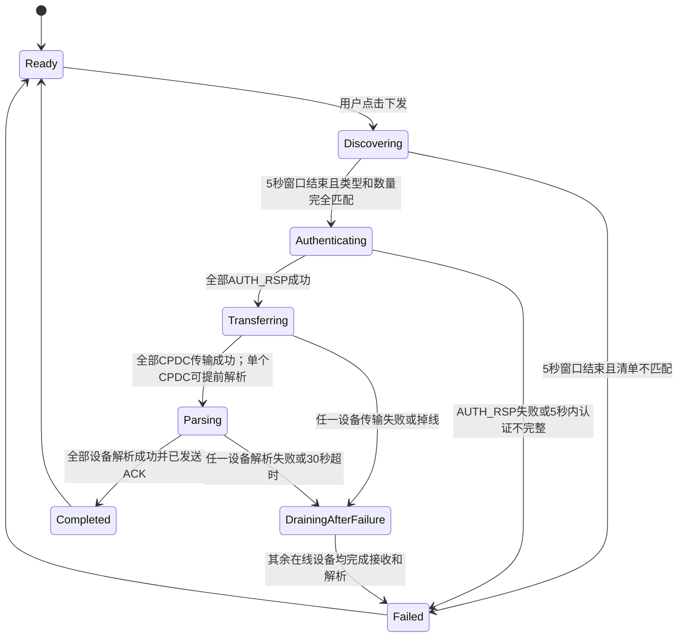
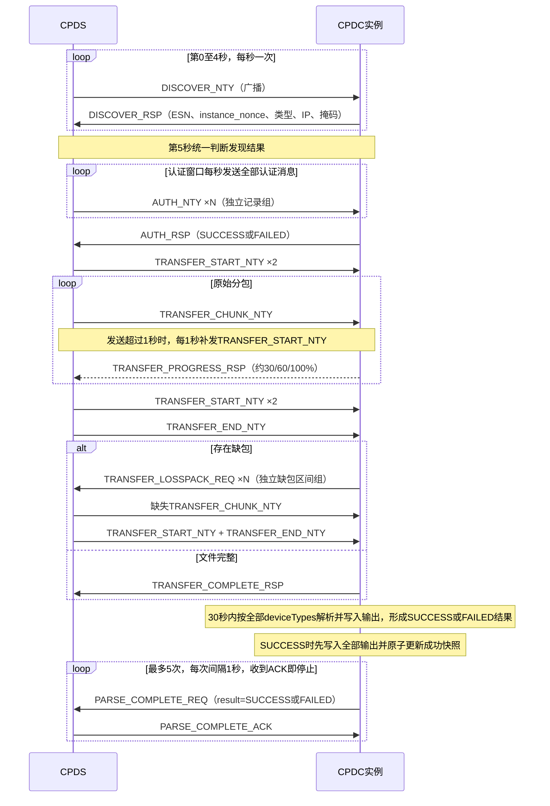

# CPDS—CPDC 交互流程需求说明书

## 1. 文档信息

- 文档状态：需求基线草案
- 日期：2026-07-20
- 关联文档：[CPDS 需求说明书](./01-CPDS-requirements.md)、[CPDC 需求说明书](./02-CPDC-requirements.md)

CPDS和CPDC项目各自保存本说明书、另外两份需求文档和本项目的Proto副本，不存在跨项目构建依赖或共享生成代码。两个 `cpd.proto`的 `package`、消息、字段号和枚举值必须保持线级兼容；任何协议修改都必须同步更新两份Proto并执行跨项目编解码兼容测试，只有 `go_package`允许因项目模块路径不同而不同。

## 2. 交互目标与约束

CPDS和CPDC通过同一二层广播域内的IPv4 UDP广播完成发现、认证、文件传输和结果确认。设备初始IPv4地址无需处于同一网段。

基本约束：

- 广播目标地址为 `255.255.255.255`。
- CPDC固定接收UDP端口为 `39001`；CPDS固定接收UDP端口为 `39002`；双方不得竞争绑定同一端口。
- 每次下发使用唯一 `session_id`。
- 同一消息可重复到达；所有处理必须幂等。
- CPDC实例可以对应多个逻辑设备类型，所有回复携带共享ESN和完整 `device_types`。
- 设备类型枚举新增 `DEVICE_TYPE_CCU_AUDIO = 8`；既有枚举编号保持不变。每个包内CCU引用由CPDS自动形成一项 `CCU`和一项 `CCU_AUDIO`期望设备，两项共享原始 `dc_ccu_*`设备ID，但由两个独立CPDC实例以不同ESN分别承担。
- 设备类型枚举新增 `DEVICE_TYPE_VEH_INTER = 9`；`VehInter`设备由 `SystemConfiguration.LANMember.VehInter`引用，设备文件前缀为 `dc_VehInter_`。
- 单个通信包最大为1 MiB（1048576字节），单个节点最多包含100个逻辑设备。
- 本协议运行在物理隔离且可信的节点内部广播网，不增加传输加密或密码学身份认证；CRC32和SHA-256只用于传输完整性校验。
- 网络按标准以太网MTU 1500字节设计。IPv4头和UDP头通常占28字节，为避免IP分片，单个UDP负载统一不得超过1400字节；其中前4字节为固定Magic，序列化Protobuf `Packet`最多1396字节。
- `AUTH_NTY`认证记录和 `TRANSFER_LOSSPACK_REQ`缺包区间使 `4 + proto.Size(Packet)`超过1400字节时，按完整记录或完整区间边界生成多条相互独立的Protobuf消息；不使用应用层分片编号，也不要求接收方重组后再处理。其他消息超过该上限时视为协议或数据错误，不允许发送。
- 不支持用户暂停、取消或手动终止。
- 同一二层广播域任一时刻只能有一个CPDS执行Distribution，并且只能接入当前待下发节点所属设备；本期不提供多CPDS选主或多个节点共享广播域的仲裁协议。

### 2.1 广播与环回双发

CPDS部署在CCU上时，本机必须独立运行CPDC。CPDS只负责服务端流程，不因部署位置而自动获得CCU、Server或其他逻辑设备身份；本机CPDC通过 `cpdc_config.json` 的 `deviceTypes` 参与发现、认证、传输和解析。

`cpdc_config.json.supportedTypes`只列出当前CPDC版本支持的全部类型供用户查看，不进入协议消息，也不参与身份、数量或认证绑定判断；交互流程始终以 `deviceTypes`为准。

双方始终采用“业务有线网卡广播 + 环回副本”机制，不检测是否同机，也不提供同机部署配置开关。业务网卡名称属于本地启动和套接字绑定策略，不属于CPD协议字段，消息中不得携带或依赖固定接口名。Windows版CPDS使用页面选定的单一业务接口；`CPDS-CCU`不要求接口参数，而是在每次Distribution开始时快照所有合格IPv4广播接口；CPDC默认使用全部合格接口，也可用 `--interface`显式限制为一张：

1. Windows版CPDS将发送套接字绑定到已选业务有线网卡或其业务IPv4；CCU版为每个合格接口分别建立绑定其业务IPv4的发送套接字，并把协议报文广播到 `255.255.255.255` 的CPDC接收端口。
2. CPDS同时将完全相同的协议报文发送到 `127.0.0.1` 的CPDC接收端口，每条逻辑消息只发送一个环回副本，不随CCU接口数量重复。
3. CPDC默认枚举全部“已启用、支持广播、非回环、非点对点且具有非回环IPv4地址”的接口，每张接口选择一个IPv4地址并分别将同一回复广播到CPDS接收端口；`--interface`可选参数可将发送范围限制为一张合格接口。
4. CPDC同时只将一份完全相同的回复发送到 `127.0.0.1` 的CPDS接收端口；多网卡不增加环回副本数量。
5. CPDC任一物理广播发送失败时按相同接口选择规则重新枚举并整体替换发送池，使用相同数据报仅重试物理广播一次；环回副本不重发。重试仍失败的接口从活动池淘汰，现有活动接口以后失败时可再次枚举恢复。
6. Linux版CPDC在初始或刷新发送池前临时关闭所有候选接口的 `rp_filter`；为保证接口值实际生效，同时临时将 `conf/all/rp_filter`设为 `0`。正常退出恢复原值，处理失败时不得启用未完成设置的新发送池；Windows版不执行该操作。
7. 环回副本使用相同消息格式、状态机和校验规则，不定义第二套业务协议。

当本机未运行对端进程时，发往 `127.0.0.1` 的副本无人接收，不影响广播流程；当双方在同一CCU运行时，该机制保证流程不依赖Linux是否把本机广播回送给本机进程。

由于本机进程可能同时收到多个接口广播副本和环回副本，双方必须执行去重和幂等处理。多发只针对本地状态机新建的出站消息；任何一方都不得转发、反射或复制收到的UDP数据报，也不得因收到RSP或ACK再生成同类型回复。CPDS-CCU每次逻辑发送最多在每个合格业务接口产生一个广播副本并额外产生一个环回副本；CPDC每次尝试在每张候选接口最多发送一个广播副本且全机只发送一个环回副本，物理发送错误时最多用原报文额外重试一次且不重发环回，因此不得形成转发环路或网络风暴：

- `DISCOVER_RSP`专门使用 `session_id + 方向 + body类型 + message_id + ESN + instance_nonce`识别重复消息，确保同一实例的广播/环回副本可以去重，同时保留相同ESN、不同nonce的冲突实例。
- 除 `DISCOVER_RSP`外的普通协议消息使用 `session_id + 方向 + body类型 + message_id + ESN（适用时）`识别重复消息；其他消息不携带也不使用 `instance_nonce`。多个CPDC回复同一条广播NTY时会复用其 `message_id`，不得只按 `session_id + message_id`去重。
- 文件分包使用 `session_id + chunk_index` 识别重复数据，重复分包校验通过后不得重复写入或累计进度。
- 重复的开始、结束、进度、解析完成和ACK消息不得重置状态或产生重复副作用；协议中要求重复消息触发重新回复的场景仍应按对应阶段规则执行。
- CPDC一旦为当前会话产生认证失败、传输失败或最终解析成功/失败结果，就进入终态等待；除仍在等待的匹配 `PARSE_COMPLETE_ACK`外，只接受新 `session_id`的 `DISCOVER_NTY`，忽略其他协议消息。CPDS也不得使用后续消息改写已经确定的设备终态。

`CPDS-CCU`的合格发送接口必须已启用、支持IPv4广播、具有可用业务IPv4，并排除环回、点对点、无线、VPN、容器、常见虚拟接口和Linux上属于其他上层接口的从属端口。接口集合在一次Distribution内固定，下次重新枚举。单个发送接口初始化或发送失败只记录错误并继续；只有没有任何发送接口成功初始化或一次逻辑发送的全部业务接口均失败时，CPDS才以 `NETWORK_INTERFACE_ERROR`结束流程。Windows和Linux接收端都监听 `0.0.0.0:39002`，不读取或过滤到达网卡索引，依靠Magic、Proto结构、当前会话、阶段及设备身份绑定过滤报文。Runner按单一逻辑流执行1 Mbit/s节流，因此每个接口约1 Mbit/s，总出口约为接口数的倍数。

同机部署的附加约束：

- `DISCOVER_RSP.current_ip`和 `subnet_mask`始终报告CPDC稳定排序后的第一张候选接口的IPv4地址和对应掩码，仅供前端显示；不能因消息从环回接口到达而报告 `127.0.0.1`或环回掩码。
- CPDS和CPDC必须使用隔离的安装、配置、缓存和输出目录；相对路径以各自可执行文件所在目录为基准。
- CCU必须允许全部合格业务接口上的广播、环回UDP和CPDS网页端口通信，两个进程必须位于可互通的网络命名空间。
- 浏览器访问CPDS属于IP单播，操作终端必须能够访问CCU管理IP；二层广播可达不能替代该条件。

### 2.2 通信包统一校验边界

CPDS导入时必须校验整个通信包中的全部单位、节点、设备和引用；CPDC在接收文件并通过SHA-256校验后执行同样的防御性复验。两端使用同一规则，至少包括：

- 原始ZIP非空且不超过1 MiB；文件名为安全的 `.zip`基本文件名。
- ZIP合法、未加密，只含普通文件和目录；拒绝路径穿越、绝对路径、盘符、NUL、符号链接、规范化后重复路径及大小写冲突路径，并校验每个文件的CRC和所有大小累计溢出。ZIP条目总数不超过4096、声明解压总量不超过64 MiB、单文件不超过8 MiB、声明解压总量与原始ZIP大小之比不超过200:1；相对路径UTF-8长度不超过1024字节、单个组件不超过255字节，并拒绝Windows保留设备名、冒号、末尾点号和末尾空格。
- 必须存在 `0_contacts`、`3_device_config`、`4_net_node`和 `6_unit`；存在无线电设备时必须另有 `1_resource`和 `2_radio_subnet`，资源目录不兼容其他名称。
- 原始通信包的业务目录直接位于ZIP根；CPDC生成的输出也不得增加额外包装层。`txbz_json_v20.zip`中的包装目录仅为输出参考样例的历史缺陷，不要求实现兼容。
- 业务目录内所有JSON语法、关键字段、单位/节点/设备引用和类型映射有效；输出产物专用的 `local_node.json`不属于CPDS业务解析范围。`File.Guid`允许数字或字符串并统一规范化为字符串；每个节点最多100个逻辑设备。
- `Radio.MR9360/dc_MR9360_*`映射为HF，`Radio.PRR206/dc_PRR206_*`映射为SmallHandheld。无线电频道Subnet必须解析到 `2_radio_subnet/<Subnet>.json`；重复引用允许，输出时去重。
- `LANMember.VehInter/dc_VehInter_*`映射为VehInter。
- `nodeId`、`deviceId`和原始文件基本名称的UTF-8长度不超过255字节；Alias不超过128字节且不含NUL、回车或换行，写入INI时使用结构化写入器而不是拼接整行文本。
- Server和IEC在同一通信节点及同一CPDC配置中均互斥。CPDC还限制 `MultiBandRadio/MultibandHandheld/HF/SmallHandheld`最多配置一种；非法组合在CPDC启动时失败，不参与发现。
- 解压前按ZIP中央目录和输出规则预估工作空间，解压期间复核实际写入量。空间不足或目录声明、CRC、实际写入量异常时不得写入正式输出。

CPDS校验失败时清空旧节点解析结果、禁用下发并显示具体原因。CPDC复验失败时不写入正式输出或成功快照，并通过失败 `PARSE_COMPLETE_REQ`返回 `ERROR_CODE_INVALID_PACKAGE`、`ERROR_CODE_INVALID_ZIP_SIZE`或对应的更具体错误码；已经通过传输完整性校验的原始ZIP仍可保留在 `./txbz/`缓存中，但不视为成功应用。

CPDS和CPDC在日志、前端弹窗及协议结构化字段中使用相同脱敏规则：不得记录 `1_resource`密钥正文、设备密码正文、原始UDP负载、完整ZIP或完整JSON；字段名包含 `password/passwd/secret/privateKey`或明确表示密钥内容时，大小写不敏感地把值替换为 `***`。本地解析日志只报告文件、字段路径、错误类型和位置，不携带原文片段。协议失败消息只携带枚举错误码，不携带自然语言原因。文件名、设备ID、节点ID、SHA-256和分包序号允许记录。

CPDS创建会话时必须冻结不可变的下发输入快照，包括原始包临时副本、文件名、哈希、大小与空间估算、当前节点、期望设备清单和认证绑定。同一CPDS进程全局只允许一个活动Distribution；会话结束前，任何浏览器或API调用都不得上传替换该包、重新解析或改变当前节点。所有START、分包和认证记录只能从该快照生成。

### 2.3 统一时间参数

Go不使用预处理器宏。CPDS和CPDC是相互独立的工程，不建立共享源码目录、共享Go包或编译依赖：

- CPDS在 `CPDS/internal/protocol/timing.go`中集中定义本项目使用的全部生产时间参数。
- CPDC在 `CPDC/internal/protocol/timing.go`中集中定义本项目使用的全部生产时间参数。
- 两个文件都使用 `time.Duration`常量，但各自只属于本项目；任何一方都不得导入另一方工程文件。

协议默认值如下：

| 所属工程 | 常量 | 默认值 | 用途 |
|---|---|---:|---|
| CPDS | `DiscoverWindow` | 5秒 | 发现完整收集窗口 |
| CPDS | `DiscoverInterval` | 1秒 | 发现通知发送间隔 |
| CPDS | `AuthWindow` | 5秒 | 认证最大窗口 |
| CPDS | `AuthRetryInterval` | 1秒 | 未完成认证时的整轮重发间隔 |
| CPDC | `RecentDiscoverValidity` | 10秒 | 新会话AUTH允许抢占旧会话的近期发现有效期 |
| CPDS | `TransferStartRefreshInterval` | 1秒 | 首轮数据发送期间START刷新间隔 |
| CPDS | `TransferWaitRetryInterval` | 1秒 | 等待传输结果时START+END重发间隔 |
| CPDS | `TransferSilenceTimeout` | 10秒 | 第一次END后单设备有效回复静默上限 |
| CPDS | `TransferNoProgressTimeout` | 30秒 | 单设备接收高水位无增长上限 |
| CPDC | `ClientSessionIdleTimeout` | 30秒 | CPDC等待传输期间判定旧CPDS会话失效 |
| CPDC | `ParseTimeout` | 30秒 | CPDC本地解析、正式输出和成功快照写入的截止时间 |
| CPDS | `ParseResultWaitTimeout` | 35秒 | CPDS等待CPDC最终解析REQ的截止时间，包含CPDC合法处理时间和消息传递余量 |
| CPDC | `ParseResultRetryInterval` | 1秒 | `PARSE_COMPLETE_REQ`重试间隔 |

CPDC结果重试次数在其自身文件中以 `ParseResultMaxAttempts` = 5定义。两个项目的生产代码必须引用各自的常量文件，不得在状态机、网络处理函数、Vue页面或其他文件重复写入等价数字。Vue需要显示倒计时时由CPDS Go后端下发当前阶段、起止时间或剩余时间。自动化测试应使用可注入时钟或计时器，不通过修改生产常量或真实等待完成超时测试。

修改某个项目的常量只影响该项目。`ParseTimeout`和 `ParseResultWaitTimeout`等两端具有协议配合关系的参数仍分别定义；修改一端时必须核对并按需要修改另一端默认值，确保CPDS等待窗口大于CPDC能够合法完成的时间，并保留结果发送和进程调度余量。该一致性通过协议兼容测试保证，不通过共享源文件保证。

## 3. 总体状态机



## 4. Proto3报文与公共信封

协议定义的唯一Protobuf基线为 [`proto/cpd.proto`](../../proto/cpd.proto)。所有消息使用Proto3二进制编码，不使用JSON或gRPC。每个IPv4 UDP负载由4字节固定Magic前缀和一个序列化后的 `Packet`组成：

| UDP负载偏移 | 长度 | 内容 |
|---:|---:|---|
| 0 | 4字节 | Magic固定为无符号32位整数 `0xEEDDCCBB`，使用网络字节序（大端），线上字节固定为 `EE DD CC BB` |
| 4 | 1～1396字节 | Proto3二进制编码的一个 `Packet` |

接收端处理顺序固定为：

1. UDP负载不足4字节时直接丢弃。
2. 按网络字节序读取前4字节；不等于 `0xEEDDCCBB`时判定为非CPD消息并直接丢弃，不执行Protobuf反序列化、不回复协议消息。
3. Magic正确后，仅对第4字节之后的数据执行 `Packet`反序列化。
4. Protobuf无法解码、没有已知 `oneof body`或字段约束非法时，按 `INVALID_MESSAGE`记录并丢弃；不得对广播中的非法消息发送错误回复。

Magic不参与Protobuf代码生成，也不写入 `Packet`。发送端必须先序列化Packet，再在其前面拼接4字节Magic；接收端移除并校验Magic后再反序列化Packet。完整UDP负载不得超过1400字节，因此 `proto.Size(Packet)`不得超过1396字节。

`Packet`只包含两个公共字段和一个 `oneof body`：

| 字段 | 说明 |
|---|---|
| `session_id` | 本次下发会话ID，UUID v4的16字节原始值，长度必须严格等于16 |
| `message_id` | 单条消息ID，UUID v4的16字节原始值，长度必须严格等于16 |
| `body` | `oneof`业务消息；同一Packet必须且只能设置一种已知消息体 |

`Packet`内部不定义 `magic`、`version`、`timestamp`和单独的 `message_type`字段；Magic属于UDP封装前缀。消息类型由 `oneof body`字段号确定；日志时间由接收方本地记录，不参与报文合法性或业务判断。当前部署需同时升级CPDS和全部CPDC，不支持协议版本协商。

发现回复和后续消息使用不同的身份粒度：

- `DISCOVER_RSP`直接携带 `esn`、`instance_nonce`、完整 `device_types`、`current_ip`和 `subnet_mask`。`instance_nonce`为CPDC每次启动生成的16字节随机值，只用于发现阶段识别同一ESN是否来自不同运行实例；IP和掩码也只用于发现记录与界面显示。
- `ClientIdentity`只包含稳定的 `esn`和完整 `device_types`，供认证回复、传输回复、缺包请求和解析结果使用，不重复携带发现阶段临时信息。

ESN为固定39位ASCII十进制数字，完整ESN用于协议、排序和后端关联，CPDS前端只显示最后6位。`current_ip`为CPDC候选接口按接口索引、接口名和IPv4地址稳定排序后的第一个IPv4地址；`subnet_mask`使用同一接口的连续IPv4点分十进制掩码，例如 `255.255.255.0`。两个字段只用于发现记录和前端显示，不表示实际收发接口，也不参与后续单播寻址或设备唯一性判断。

### 4.1 消息清单

协议共定义以下12类消息：

| 消息 | 发送方 | 主要业务字段 |
|---|---|---|
| `DISCOVER_NTY` | CPDS | 空消息体 |
| `DISCOVER_RSP` | CPDC | `esn/instance_nonce/device_types/current_ip/subnet_mask` |
| `AUTH_NTY` | CPDS | `assignments[]`，每项含 `device_type/esn/node_id/device_id` |
| `AUTH_RSP` | CPDC | `client/result`；成功含 `node_id/bindings[]`，失败含 `error_code`及可选冲突详情 |
| `TRANSFER_START_NTY` | CPDS | `file_name/file_size/file_sha256/expanded_size/required_workspace/chunk_size/total_chunks` |
| `TRANSFER_CHUNK_NTY` | CPDS | `chunk_index/payload/payload_crc32` |
| `TRANSFER_PROGRESS_RSP` | CPDC | `client/received_chunks/total_chunks/percent` |
| `TRANSFER_END_NTY` | CPDS | 空消息体 |
| `TRANSFER_LOSSPACK_REQ` | CPDC | `client/missing_ranges[]`，每项为闭区间 `start/end` |
| `TRANSFER_COMPLETE_RSP` | CPDC | `client/result/stage/received_chunks/error_code` |
| `PARSE_COMPLETE_REQ` | CPDC | `client/result/node_id/bindings[]/type_results[]/error_code` |
| `PARSE_COMPLETE_ACK` | CPDS | `esn/device_types/result` |

字段和消息关联规则：

- CPDS主动通知使用 `*_NTY`；CPDC针对NTY的回复使用 `*_RSP`。RSP的 `Packet.message_id`直接复制触发它的NTY的 `message_id`，不再定义 `nty_message_id`。
- CPDC主动请求使用 `*_REQ`；CPDS针对REQ的确认使用 `*_ACK`。ACK的 `Packet.message_id`直接复制触发它的REQ的 `message_id`，不再定义 `req_message_id`。
- 每条逻辑消息首次发送时创建新的 `message_id`；同一次“广播 + 环回”双发以及同一逻辑消息的定时重发复用原ID和完全相同的消息体。内容或业务含义不同的新逻辑消息使用新ID。
- `TRANSFER_LOSSPACK_REQ`每次重新检查得到的缺包集合属于新逻辑请求并使用新ID，且没有ACK；同一逻辑 `PARSE_COMPLETE_REQ`重试时复用原ID，收到对应 `PARSE_COMPLETE_ACK`后停止。
- `TRANSFER_COMPLETE_RSP`在PRECHECK或缓存命中时复制触发它的START消息ID；处理CHUNK时发生需要立即上报的接收I/O错误，复制触发错误的CHUNK消息ID；完成接收后的大小、缓存写入或整体哈希结果复制触发检查的END消息ID。
- `message_id`只用于关联和幂等，不作为设备身份、安全凭据或其他业务判断条件；除长度和REQ/RSP关联外不增加额外消息ID校验机制。
- 因为多个CPDC针对同一广播NTY复制同一 `message_id`，接收端不能只使用两个ID去重。`DISCOVER_RSP`额外使用ESN和 `instance_nonce`，其他设备回复使用ESN且不使用nonce。
- `device_types`比较采用集合语义，不依赖保存顺序；`bindings`必须完整覆盖本实例得到认证的所有设备类型。
- `AUTH_RSP.result`只允许 `RESULT_SUCCESS`或 `RESULT_FAILED`。成功时必须包含完整绑定并使用 `ERROR_CODE_UNSPECIFIED`；失败时必须包含非零稳定 `error_code`，不得携带可被误用为成功绑定的字段。
- `missing_ranges`按 `start`升序排列，各闭区间不得重叠或相邻，相邻缺包必须合并。
- `percent`为0至100的整数，按唯一有效分包数计算；约30%和60%的首次上报可携带跨越阈值后的实际整数，完成时必须为100。
- `file_name`必须是UTF-8长度不超过255字节的基本文件名，不得包含 `/`、`\\`、盘符或 `..`；`node_id`和 `device_id`的UTF-8长度也不得超过255字节。`file_sha256`为32字节原始SHA-256值，界面和日志需要显示时再编码为64位小写十六进制字符串。
- 承担必填业务语义的枚举不得使用零值：`Result`必须为SUCCESS或FAILED，设备类型必须为已定义具体类型，失败结果的阶段必须为具体阶段。成功结果的 `error_code`必须为 `ERROR_CODE_UNSPECIFIED`，失败结果的 `error_code`必须为对应非零值；成功的 `ParseTypeResult.stage`使用 `PARSE_STAGE_UNSPECIFIED`。接收方必须拒绝缺失必填语义、ID长度错误、无法解码、未知 `body`、`proto.Size(Packet)`超过1396字节或字段约束不满足的消息；Proto3未知字段可以忽略。
- 所有成功消息的 `error_code`必须为 `ERROR_CODE_UNSPECIFIED`，所有失败消息的 `error_code`必须是对应的非零 `ErrorCode`。Proto不定义或传输自然语言错误字符串。
- `AUTH_NTY`和 `TRANSFER_LOSSPACK_REQ`按加入下一条完整记录后的 `4 + proto.Size(Packet)`试装；超过1400字节时结束当前消息，将多出的完整记录放入下一条新消息。单条记录本身仍无法装入时返回 `INVALID_MESSAGE`，不得拆分记录。

### 4.2 统一错误码

CPDS和CPDC必须使用下表中的稳定错误码进行协议、日志和UI映射。`ErrorCode`是唯一失败语义；CPDS前端根据枚举值从三套语言资源中取得用户可读文案，语言切换不改变协议数据或会话结果。Proto、CPDS后端接口和CPDC回复均不得传输自由文本错误原因。

| 错误码 | 含义 |
|---|---|
| `INVALID_MESSAGE` | Protobuf无法解码、消息体未知、必填语义或字段约束无效 |
| `INVALID_PACKAGE` | ZIP或通信配置包结构、引用关系无效 |
| `PACKAGE_TOO_LARGE` | 原始ZIP超过1 MiB |
| `INVALID_ZIP_SIZE` | ZIP声明大小、实际解压大小或空间计算异常 |
| `INSUFFICIENT_STORAGE` | 目标文件系统空间不足 |
| `AUTH_ASSIGNMENT_CONFLICT` | CPDS发送前发现认证记录不唯一 |
| `AUTH_CONFLICT` | CPDC收到相同类型和ESN对应不同绑定 |
| `AUTH_BINDING_MISSING` | CPDC未取得全部本机类型绑定 |
| `BUSY` | 新会话认证窗口内，旧会话当前单文件正式写操作仍无法安全返回；可取消的解析暂存和结果确认状态不得返回BUSY |
| `FILE_SIZE_MISMATCH` | 接收文件大小不符合开始通知 |
| `FILE_HASH_MISMATCH` | 原始文件SHA-256校验失败 |
| `STORAGE_IO_ERROR` | 临时接收文件、原始包缓存或原始输入读取失败，不用于正式输出写入 |
| `PARSE_OUTPUT_FAILED` | 业务解析、筛选、内容校验或临时归档生成失败 |
| `PARSE_TIMEOUT` | CPDC解析、正式输出和成功快照写入未在30秒内完成，或CPDS在35秒等待窗口内未收到最终解析REQ |
| `OUTPUT_WRITE_FAILED` | 正式输出或成功快照写入失败，使用 `ParseStage`区分输出与快照阶段 |
| `SKIPPED_AFTER_PREVIOUS_FAILURE` | 多类型实例中因前一类型失败而未继续执行当前类型 |
| `SESSION_TIMEOUT` | 当前会话因静默超时失效 |
| `DISCOVERY_MISMATCH` | 发现设备类型或数量与当前节点期望清单不一致 |
| `ESN_CONFLICT` | 相同ESN由不同运行实例报告 |
| `AUTH_TIMEOUT` | 认证窗口结束时仍缺少成功回复或完整绑定 |
| `TRANSFER_SILENCE_TIMEOUT` | 第一次END后单设备连续10秒没有自身有效回复 |
| `TRANSFER_NO_PROGRESS` | 单设备持续回复但接收高水位连续30秒未增长 |
| `NETWORK_INTERFACE_ERROR` | 没有合格业务接口、显式接口不合格、全部接口绑定/初始化失败、刷新前后均无物理广播发送成功，或广播、环回、接收UDP套接字初始化失败；任一端单个发送接口失败且仍有其他接口成功时不产生该错误 |

以上错误码统一定义在Proto `ErrorCode`枚举中。部分错误只由CPDS本地产生并用于日志、弹窗和Vue状态，不要求一定出现在UDP消息中；系统不得再定义第二套字符串错误码。每个非零枚举值都必须在三套前端语言资源中具有翻译，缺失翻译键必须由构建检查或自动化测试发现。

## 5. 阶段一：发现

### 5.1 CPDS请求

用户点击“下发”后，CPDS创建 `session_id`并开始完整5秒发现窗口。CPDS在第0、1、2、3、4秒各广播一次 `DISCOVER_NTY`，同一发现窗口的重复发送复用同一 `message_id`；第5秒统一结束收集，即使设备类型和数量提前匹配也不得提前进入认证。

### 5.2 CPDC回复

CPDC收到通知后广播 `DISCOVER_RSP`，其 `Packet.message_id`复制对应 `DISCOVER_NTY`的ID，并直接携带ESN、启动实例标识、完整设备类型、当前业务IPv4地址和对应掩码。对重复通知可以重复回复，但同一进程生命周期内必须使用相同ESN和 `instance_nonce`；IP或掩码在发现窗口内发生变化时发送最新值。

CPDS收到合法 `DISCOVER_RSP`后立即更新前端临时发现视图，按设备类型内ESN升序与通信包设备顺序显示已经上线的逻辑设备、ESN后6位和当前IP。该视图不创建认证绑定；第5秒结算失败时继续保留已发现设备，阶段条停在失败的“发现”步骤并弹出具体原因。

### 5.3 去重与冲突

- 相同ESN、相同 `instance_nonce`：同一CPDC的重复回复。
- 相同ESN、不同 `instance_nonce`：不同实例发生ESN冲突，发现失败。

ESN冲突不通过网络协议自动修复。CPDS弹窗显示ESN后6位、各实例IP、设备类型和nonce摘要，提示停止其中一台CPDC、手工清空其 `cpdc_config.json.esn`并重新启动。CPDC仅在启动时发现ESN为空后生成并原子持久化新值；写回失败时不得进入网络交互。若同一物理CPDC恰好在发现窗口内重启造成nonce变化，本次发现同样安全失败，设备稳定后重新Distribution即可。
- 多类型CPDC的每个 `device_types`元素分别计为一个逻辑设备。
- 每个包内CCU引用固定计为两个逻辑设备：一台 `CCU`和一台 `CCU_AUDIO`。二者分别运行CPDC并使用独立ESN，不按多类型CPDC合并计数。

### 5.4 成功判定

CPDS将当前节点期望的类型计数与上线逻辑设备类型计数比较：

- 类型集合和各类型数量完全相同：发现成功。
- 缺少、多出、冲突或数量不一致：发现失败。

第5秒结束后统一比较窗口内全部有效回复。仍不匹配时弹窗显示差异，例如“缺少1台MultiBandRadio”或“多出1个Server”。

## 6. 阶段二：认证

### 6.1 同类型自动配对

每种设备类型分别执行：

1. 将对应在线CPDC按固定39位ESN字符串升序排序。
2. 读取当前节点 `SystemConfiguration` 中该设备类型数组的原始顺序。
3. 按索引配对ESN与设备ID。

多类型CPDC共享ESN，但分别取得每种类型的认证记录。

对同一个包内CCU引用，CPDS分别为 `CCU`和 `CCU_AUDIO`执行同类型ESN排序与配对，并生成两条认证记录。两条记录的 `device_type`和ESN不同，但允许引用同一个原始 `dc_ccu_*`设备ID；双方必须按 `(deviceType, deviceId)`区分绑定和状态，不得只按设备ID覆盖其中一项。

CPDS在发送前必须验证：每个 `(deviceType, ESN)`只对应一个 `deviceId`，每个 `(deviceType, deviceId)`只对应一个ESN，并且类型数量与发现结果及节点期望清单一致。发现冲突时以 `AUTH_ASSIGNMENT_CONFLICT`在本地终止认证，不发送冲突记录。

### 6.2 认证通知

如果 `4 + proto.Size(Packet)`不超过1400字节，CPDS只发送一条 `AUTH_NTY`；否则按记录边界生成多条相互独立的 `AUTH_NTY`。以下为便于阅读的Protobuf文本表示，线上传输时前置Magic并使用二进制编码：

```protobuf
session_id: "<16-byte UUID>"
message_id: "<16-byte UUID>"
auth_nty {
  assignments {
    device_type: DEVICE_TYPE_CCU
    esn: "082716493501927364850192736485019273648"
    node_id: "nn_vehicle_1001010000"
    device_id: "dc_ccu_10.64.0.1"
  }
  assignments {
    device_type: DEVICE_TYPE_SERVER
    esn: "082716493501927364850192736485019273648"
    node_id: "nn_vehicle_1001010000"
    device_id: "dc_server_683771570"
  }
}
```

拆分规则：

1. 先按当前节点完成配对后的固定认证记录顺序组包，认证记录本身不得拆开。
2. CPDS按加入下一条完整记录后的实际 `4 + proto.Size(Packet)`试装；超过1400字节时结束当前消息，并把多出的记录放入下一条新消息。
3. 每条消息都有独立 `message_id`和独立 `assignments`数组，不携带集合ID、分片序号或分片总数；接收方收到后可立即处理其中记录。
4. 单条认证记录连同Magic和公共字段仍超过1400字节时，认证阶段失败并显示数据超长，不允许发送IP分片报文。
5. 同一消息的广播、环回副本和下一秒定时重发均复用相同 `message_id`；认证记录的分组和内容保持不变。

CPDS在第0秒广播一轮全部认证消息；认证尚未结束时，在第1、2、3、4秒分别重发完整一轮。每轮都发送拆分后的全部 `AUTH_NTY`，消息分组和内容保持不变。

### 6.3 CPDC保存与回复

CPDC收到任一 `AUTH_NTY`后立即按ESN和本地配置 `deviceTypes`筛选属于自己的记录，并按当前 `session_id + device_type`累计和去重保存。本实例可以从不同认证消息中取得不同设备类型的绑定；不需要等待、重组或判断全网认证消息是否全部到达。

同一会话相同 `device_type + ESN`重复出现相同绑定时按重复消息处理；出现不同 `node_id`或 `device_id`时，CPDC不得覆盖已有绑定，立即广播 `AUTH_RSP`，其中 `result=RESULT_FAILED`、`error_code=ERROR_CODE_AUTH_CONFLICT`，并在冲突详情中携带设备类型、已有绑定和新收到的绑定。同一多类型CPDC取得的所有绑定还必须具有完全相同的 `node_id`；任意两个类型落在不同节点时同样以 `ERROR_CODE_AUTH_CONFLICT`失败，不得发送成功认证回复。

新会话只有在CPDC最近10秒内收到过同一 `session_id`的 `DISCOVER_NTY`时才允许抢占旧会话。旧会话处于认证、等待传输、接收或缺包补发状态时立即清理未完成临时内容并接受新认证；处于解析暂存阶段时协作取消解析、清理暂存内容并接受；处于正式文件写入阶段时等待当前单文件操作返回后停止剩余写入，不恢复已经清空或写入的文件；处于等待最终ACK状态时停止旧结果重发，但保留已经写入的输出、原始包缓存和成功快照。新会话生效后忽略所有旧会话报文。

当前单文件写操作无法在新会话认证窗口内返回时，CPDC通过失败 `AUTH_RSP`返回 `ERROR_CODE_BUSY`。认证冲突和忙碌状态均通过失败 `AUTH_RSP`表达，不定义独立消息类型。

当本实例配置 `deviceTypes`中的每一种类型都已经取得唯一有效的 `node_id/device_id`后，广播一条 `AUTH_RSP`，其中 `result=RESULT_SUCCESS`，并包含完整 `client`、`node_id`和 `bindings`。重复认证消息不得产生重复绑定，但可以触发幂等重发相同成功回复。

### 6.4 认证结果

- 5秒是认证最大窗口。窗口内收到全部逻辑设备的成功 `AUTH_RSP`时立即进入传输阶段，不再发送剩余认证轮次。
- 收到任一 `result=RESULT_FAILED`的 `AUTH_RSP`时立即失败，不等待5秒窗口结束。`error_code=ERROR_CODE_AUTH_CONFLICT`时显示冲突类型、ESN和两个设备ID；`ERROR_CODE_BUSY`时显示当前语言资源中的对应文案。
- 到第5秒仍有设备缺少成功回复或缺少绑定时，以认证超时失败，弹窗显示全部缺失设备的类型、ESN和原因。
- 发现阶段仍完整等待5秒以发现额外设备，不采用认证阶段的提前成功规则。

## 7. 阶段三：通信包传输

### 7.1 文件开始通知

CPDS在首轮数据发送前连续广播 `TRANSFER_START_NTY` 两遍。开始通知至少包含：

| 字段 | 说明 |
|---|---|
| `file_name` | 原始通信包基本文件名 |
| `file_size` | 文件总字节数 |
| `file_sha256` | 原文件SHA-256，使用32字节原始值 |
| `expanded_size` | CPDS读取ZIP中央目录得到的所有普通文件预计解压总字节数；用于提前发现异常压缩比、预估解压空间，并供CPDC接收完成后与其独立计算结果及实际写入量对比 |
| `required_workspace` | 完成接收、缓存替换、解压和输出生成期间可能同时占用的保守磁盘空间，覆盖接收临时文件、原始包缓存、解压内容、暂存输出及20%余量 |
| `chunk_size` | 固定为1200，表示标准数据分包的文件负载字节数 |
| `total_chunks` | 分包总数 |

`file_size`必须大于0且不超过1 MiB。为避免文件数据报发生IP分片，标准数据分包的文件负载固定为1200字节，只有最后一个分包可以小于1200字节。`total_chunks = ceil(file_size / 1200)`；1 MiB文件最多包含874个分包。

CPDS在下发前读取ZIP中央目录计算 `expanded_size`，并保守估算：

`required_workspace = 原始ZIP + 解压内容 + 所有暂存输出 + 20%余量`

同一条开始通知广播给所有设备，因此CPDS必须按已认证CPDC实例的 `device_types`分别估算，再把其中最大值写入 `required_workspace`。

CPDC收到开始通知时必须在创建临时接收文件前校验文件大小、文件名、哈希、分包参数、认证绑定和目标文件系统空间。原始包为0或超过1 MiB、开始参数非法、认证绑定缺失或空间不足时发送 `TRANSFER_COMPLETE_RSP`，其中 `result=RESULT_FAILED`、`stage=TRANSFER_STAGE_PRECHECK`并携带对应非零 `error_code`。同机空间系数由CPDC发布目标确定：`CPDC-CCU`固定按 `required_workspace × 2`检查，其他目标按 `required_workspace`检查，不探测CPDS进程，也不根据逻辑设备类型推断。CPDC收齐ZIP后还必须独立读取中央目录并重新计算，解压过程中累计实际输出；实际值与声明不符或空间不足时不得写入任何正式输出。

CPDS收到某CPDC失败的 `TRANSFER_COMPLETE_RSP`后，将该设备记为传输失败终态并把本次会话标记为“最终失败、正在完成其他在线设备”，停止为该失败设备单独补包，但不得停止其他在线设备的发送、补发、解析和最终结果确认。只有全部期望CPDC都进入成功或失败终态后，才结束本次会话并弹出汇总失败结果。

开始通知重发规则：

1. 首轮数据发送前连续发送2次 `TRANSFER_START_NTY`。
2. 首轮数据发送持续超过1秒时，发送期间每1秒补发一次相同会话的开始通知，不再按每10个分包重发。
3. 首轮全部数据分包发送完毕后，再连续发送2次 `TRANSFER_START_NTY`，随后发送 `TRANSFER_END_NTY`。
4. 等待设备结果期间，每1秒按顺序重发一次 `TRANSFER_START_NTY + TRANSFER_END_NTY`，直至对应设备返回有效结果或达到静默失败条件。
5. 每轮缺包补发完成后发送一次 `TRANSFER_START_NTY + TRANSFER_END_NTY`。

CPDC对重复开始通知必须幂等，不得清空当前接收数据。如果CPDC丢失首部开始通知并忽略了此前数据，它通过尾部或等待期重发的开始通知创建接收上下文，再在结束检查中把全部未接收分包报告为缺失。

### 7.2 原始包缓存与复用

CPDC必须在可执行文件目录下维护 `./txbz/`原始包缓存，缓存“最近一次接收完整且文件大小、SHA-256校验成功”的原始ZIP，并保留CPDS发送的原始文件名。该缓存与 `cpdc_config.json`中的“最近一次成功应用快照”含义不同：文件接收成功但后续解析失败时，新原始包仍可作为接收成功缓存保留，成功应用快照不得更新。

`./txbz/`正常状态只保留一个已校验原始包。接收新文件时先写入会话临时文件并校验，随后逐个删除旧缓存普通文件，再把新文件重命名到缓存目录；不备份或恢复旧缓存，写入失败时按传输失败处理。程序启动或收到开始通知时不得只相信文件名或配置记录，必须读取缓存文件并校验实际文件大小和SHA-256。

收到 `TRANSFER_START_NTY`后按以下顺序判断：

1. `file_name`和实际缓存文件名一致，且对缓存文件重新计算得到的SHA-256与 `file_sha256`一致，才判定“文件包一致”。文件名相同但哈希不同、哈希相同但文件名不同、缓存缺失或读取/校验失败均不命中缓存。
2. 文件包一致：只跳过文件接收，发送 `result=RESULT_SUCCESS`、`stage=TRANSFER_STAGE_CACHE_REUSE`的 `TRANSFER_COMPLETE_RSP`，然后使用缓存原始包和本次认证绑定进入30秒解析流程。
3. 文件包不一致：创建接收上下文并正常接收；完整校验成功后先更新 `./txbz/`缓存，再使用新缓存文件解析。

AUTH发生在START之前，是否命中文件缓存必须等收到包含文件名和SHA-256的START后判断。成功快照不得用于跳过本次解析；即使包、nodeId、完整deviceId绑定和快照全部一致，CPDC也必须实际执行解析、写入正式输出并上报本次结果。CPDS仍可继续向其他尚未完成的CPDC广播同一文件；已返回传输成功的CPDC忽略本会话后续分包和结束通知，但对重复START幂等重发相同 `TRANSFER_COMPLETE_RSP`。

### 7.3 数据分包

`TRANSFER_CHUNK_NTY`与其他消息一样使用“4字节Magic + Proto3 Packet”封装，不定义其他固定二进制头。消息体包含从0开始的 `chunk_index`、最长1200字节的 `payload`和 `payload_crc32`。CRC使用Go `hash/crc32.ChecksumIEEE`等价的CRC-32/IEEE算法；接收端必须先校验Magic，再反序列化并校验会话、分包序号、负载长度和CRC，最后写入文件。

除最后一个分包外，`payload`长度必须为1200；最后一个分包长度为 `file_size - chunk_index * 1200`。CPDC按 `chunk_index * 1200`计算写入偏移并记录接收位图。UDP乱序和重复分包不得破坏文件。序列化 `Packet`不得超过1396字节，拼接Magic后的完整UDP负载不得超过1400字节。文件收齐后使用START中的 `file_sha256`对原始文件执行SHA-256整体校验。

CPDS使用令牌桶或等效机制控制文件数据的默认名义负载发送速率为1 Mbit/s，不允许在无节流的循环中瞬间发送全部分包。该值由CPDS自己的 `CPDS/internal/protocol/transfer.go`中 `TransferPayloadRateBitsPerSecond = 1_000_000`定义，不写入Proto，也不要求CPDC配置一致。操作系统调度、重复开始通知、缺包重传和网络丢包造成的实际有效速率可以低于该值。速率限制只约束 `TRANSFER_CHUNK_NTY`文件负载；首轮发送期间仍不启动10秒静默计时，为某设备补发时只暂停该设备计时。

1 MiB原始包在1 Mbit/s纯文件负载速率下的首轮理论发送时间约8.39秒，协议头和系统调度会使实际时间略长。该时长小于或超过任何等待阈值都不影响规则：第一次 `TRANSFER_END_NTY`发出前不执行设备静默判定。

### 7.4 接收进度

CPDC在有效唯一分包比例首次达到约30%、60%、100%时广播 `TRANSFER_PROGRESS_RSP`，携带ESN、完整 `deviceTypes`、进度和已接收分包数。

CPDS界面的全局发送进度由服务端首轮已发送分包数连续计算；设备接收进度以CPDC报告为准。首轮发送结束后全局发送进度保持100%，缺包重传期间显示“补发中”和待补发分包数量。

### 7.5 结束检查与缺包补发

CPDS完成首轮发送后按第7.1节再次发送开始通知，再广播消息体为空的 `TRANSFER_END_NTY`。文件名、大小、SHA-256和总分包数均取自当前会话已接受的 `TRANSFER_START_NTY`，END不得重复携带这些字段。CPDC检查接收位图：

- 有缺包：将连续缺失序号合并为闭区间并广播一条或多条 `TRANSFER_LOSSPACK_REQ`。
- 无缺包且整体校验成功：将原始包写入 `./txbz/`缓存后，广播 `result=RESULT_SUCCESS`、`stage=TRANSFER_STAGE_VERIFY`的 `TRANSFER_COMPLETE_RSP`。
- 无缺包但大小、哈希或缓存写入失败：广播 `result=RESULT_FAILED`的 `TRANSFER_COMPLETE_RSP`，以 `stage/error_code`说明失败位置和枚举原因，不得进入解析。

缺包区间拆分规则：

1. 缺失区间按 `start`升序排列，重叠或相邻区间先合并；单个区间记录不得拆开。
2. CPDC按加入下一条完整区间后的实际 `4 + proto.Size(Packet)`试装；超过1400字节时结束当前消息，并把多出的区间放入下一条新消息。
3. 每条 `TRANSFER_LOSSPACK_REQ`都有独立 `message_id`和独立 `missing_ranges`数组，并重复携带本CPDC公共身份字段；不携带集合ID、分片序号或分片总数。
4. 同一消息的广播和环回副本使用相同 `message_id`。单个完整区间理论上能够装入报文；实现仍须在发送前执行 `4 + proto.Size(Packet) <= 1400`检查，失败时以本地协议错误结束传输并上报失败 `TRANSFER_COMPLETE_RSP`。

`TRANSFER_LOSSPACK_REQ`不定义、也不发送ACK。CPDS收到任一有效REQ后立即把其中区间并入当前会话待补发集合，无需等待同一CPDC的其他请求，也不执行分片重组；相同CPDC或不同CPDC重复报告的区间按并集幂等合并。

CPDS持续接收并合并到达的缺包请求，补发当前已知的缺失分包。补发完成后广播一次 `TRANSFER_START_NTY + TRANSFER_END_NTY`，CPDC重新检查全部接收位图并重新上报仍然缺失的区间。因此某条独立缺包REQ丢失时，其区间会在后续结束检查轮次再次报告。只要仍收到缺包请求，就持续执行该循环，不限制补发轮数。

### 7.6 超时规则

- 首轮 `SENDING`期间不执行10秒静默计时。
- 第一次发送 `TRANSFER_END_NTY`后，每个CPDC分别进入自己的 `WAITING_RESULT`并使用单调时钟独立计时；其他设备的回复不能重置本设备计时。
- 只有本设备的有效回复能够重置其10秒静默计时。CPDS发送START、END或为其他设备补包均不能重置或暂停本设备计时。
- CPDS正在补发本设备请求的缺失分包时，仅暂停本设备的10秒静默计时；该轮补发结束并发送END后恢复计时。
- 某设备等待自身有效回复连续达到10秒时，将其记为传输失败终态，不再为其单独补包，但继续完成其他在线设备流程。
- CPDS按每个设备最新进度回复或缺包区间计算其唯一有效接收分包数，并维护接收高水位。第一次END后，如果某设备虽持续回复但连续30秒高水位没有增加，则以“传输无进展”记为失败；只要高水位继续增加，缺包补发不限制轮数。

## 8. 阶段四：CPDC解析

每个CPDC在自身文件接收及整体SHA-256校验成功后立即根据认证绑定和本地 `deviceTypes` 执行解析，不等待其他CPDC。多个CPDC可以同时处于“接收、补发、解析或已完成”不同状态：

- 所有无线电解析规则统一读取并保留业务资源目录 `1_resource`；协议和实现不得接受其他一级资源目录名作为其别名。
- `MultiBandRadio`、`MultibandHandheld`：生成 `plan_local.tar`、普通tar格式的 `mission.tar.gz`，修改完整ReReadJson.ini字段。
- `HF`、`SmallHandheld`：生成 `plan_local.tar`，只要求设置 `ReReadVal=1`。
- `VehInter`：生成 `vehinte.tar`，包含 `0_contacts/` 与 `6_unit/` 全量、绑定的 `dc_VehInter_*.json` 及当前节点 `nn_*.json`；更新 `ReReadJson.ini` 设置 `ReReadVal=1`。
- `CCU`：递归清空 `./txbz_ccu/`全部内容但保留根目录，把本CCU设备配置写入该目录；随后只删除 `../../update/`直属目录下匹配 `dc_ccu_*.json`的普通文件，不递归且不处理子目录或其他文件，再把配置复制到 `../../update/<原设备配置文件名>`；复制成功后再次递归清空并保留 `./txbz_ccu/`根目录。成功状态下配置文件只保留在 `../../update/`。
- `CCUAudio`：按CCU规则递归清空并保留 `./txbz_ccu/`根目录，把本CCU设备配置写入该目录；随后只逐个删除相对CPDC可执行文件目录的 `../update/`直属、匹配 `dc_ccu_*.json`的普通文件，不递归且不影响其他文件或子目录，再复制到 `../update/<原设备配置文件名>`；复制成功后递归清空并保留 `./txbz_ccu/`根目录。
- `Server`、`IEC`：在完整原始包中创建唯一的 `local_node.json`，清空 `./txbz_server/`直属普通文件后，以原始通信包文件名写入该目录；原始通信包不依赖该文件。两种类型都必须递归清空并保留 `../txbz_data/`根目录，按原始通信包文件名去掉末尾 `.zip`扩展名创建子目录，并将包含本次 `local_node.json`的完整输出包解压到 `../txbz_data/<原始通信包文件名去掉.zip>/`，不得直接平铺到根目录。

多类型实例必须返回每种类型的解析结果。任一类型失败时，实例级解析失败。

CPDC解析期间不发送周期性状态、心跳或解析进度。CPDS在解析阶段只能将尚未返回最终结果的设备显示为“等待解析结果”，不得推测或展示“解析中”进度。进度条仅属于Transfer阶段。

CPDS全局阶段在全部必需CPDC完成传输前保持 `Transferring`，但必须随时接收并处理已提前完成解析的CPDC最终结果。收到有效 `PARSE_COMPLETE_REQ`时必须立即回复 `PARSE_COMPLETE_ACK`，不得等待全局阶段切换。

同一CPDC支持多个设备类型时，先生成并校验全部临时产物，再依次清空各类型目标并写入新文件。系统不建立输出备份、事务清单或回滚点；任一类型、正式文件或 `cpdc_config.json`成功快照写入失败时停止剩余处理，已经清空或写入的正式输出保持现状。只有全部类型写入成功后才原子更新成功快照并报告成功。

`CCUAudio`同样不回滚：复制到 `../update`失败时保留 `./txbz_ccu`中已生成的文件；复制成功但随后清空 `./txbz_ccu`失败时保留 `../update`中的文件。两种情况均报告解析失败且不更新成功快照。全部步骤成功时，最终配置文件保留在 `../update`，`./txbz_ccu`为空。

`CCU`、Server和IEC新增输出同样不回滚。`CCU`清理 `./txbz_ccu`、清理 `../../update`中的匹配文件、复制或最终清理任一步失败时报告解析失败且不更新成功快照；Server或IEC清理、解压 `../txbz_data`失败时保留已经写入的 `./txbz_server`及 `../txbz_data`现状，报告解析失败且不更新成功快照。`./txbz_ccu`和 `../txbz_data`的清理递归删除根目录内全部文件和子目录并保留根目录；`CCU`的 `../../update`和 `CCUAudio`的 `../update`都只删除直属匹配 `dc_ccu_*.json`的普通文件。

CPDC从发送成功 `TRANSFER_COMPLETE_RSP`后开始30秒本地解析截止计时。该成功可能来自新文件完整校验，也可能来自 `TRANSFER_STAGE_CACHE_REUSE`；任何情况下都必须重新执行解析。解析、输出生成、正式文件写入及成功快照写入都必须在该期限内完成。超过30秒时取消剩余操作并以 `result=RESULT_FAILED`、`error_code=ERROR_CODE_PARSE_TIMEOUT`发送 `PARSE_COMPLETE_REQ`；尚未写入的暂存内容必须清理，已经清空或写入的正式输出不回滚。多类型处理因某个类型失败而停止后，已经成功的类型保留SUCCESS结果，直接失败的类型携带实际阶段和错误码，尚未执行的类型使用 `result=RESULT_FAILED`、`stage=PARSE_STAGE_SKIPPED`和 `error_code=ERROR_CODE_SKIPPED_AFTER_PREVIOUS_FAILURE`，从而仍然为每个 `client.device_types`元素返回恰好一项结果。

CPDS收到某CPDC成功的 `TRANSFER_COMPLETE_RSP`后，一律为该实例启动独立35秒解析结果等待计时。重复的传输完成回复不得暂停、延长或重置计时。35秒内未收到有效最终REQ时，将该设备以 `PARSE_TIMEOUT`记为失败终态；迟到的有效最终REQ仍回复ACK，但不改写已经确定的超时失败终态。其他CPDC仍在传输、补发或解析不得影响该实例计时，也不得因本设备失败而被提前终止。

## 9. 阶段五：解析结果确认

### 9.1 CPDC上报

CPDC只使用 `PARSE_COMPLETE_REQ`上报解析最终结果，成功和失败共用同一REQ及ACK，不再定义独立失败消息。该请求至少包含：

- ESN。
- 完整 `deviceTypes`。
- `result`，只允许 `SUCCESS`或 `FAILED`。
- `type_results`必须与 `client.device_types`顺序一致，并且每种类型恰好一项；协议和文档统一使用Proto字段名 `type_results`，Vue映射时才使用 `typeResults`。
- `result=RESULT_SUCCESS`时，顶层和每项类型结果都使用 `error_code=ERROR_CODE_UNSPECIFIED`，每项成功类型的 `stage=PARSE_STAGE_UNSPECIFIED`。
- `result=RESULT_FAILED`时携带非零顶层 `error_code`，失败类型项必须包含设备类型、设备ID、失败阶段和非零枚举错误码；如果在类型解析前发生全局错误，所有类型项都标记失败并复用该全局错误码。

CPDC在本次Distribution完成全部解析、正式输出写入和成功快照更新后，本地即确认解析成功，并在第一次发送 `result=RESULT_SUCCESS`的 `PARSE_COMPLETE_REQ`之前原子更新 `txbzName`、`txbzHash`、`nodeId`和完整 `deviceIds`。ACK只表示CPDS已经收到最终结果，不决定CPDC本地成功状态或成功快照写入时机。

任一设备类型解析、校验、正式输出写入或成功快照写入失败时，CPDC发送 `result=FAILED`的 `PARSE_COMPLETE_REQ`。失败结果不得更新成功快照，但已经清空或写入的正式输出不回滚。

无论结果成功还是失败，CPDC发送 `PARSE_COMPLETE_REQ`后等待1秒；未收到有效 `PARSE_COMPLETE_ACK`则复用同一 `message_id`和完全相同的消息体重发，最多发送5次。最终结果不是解析过程状态或进度上报。

### 9.2 CPDS确认

CPDS收到有效 `PARSE_COMPLETE_REQ`后广播 `PARSE_COMPLETE_ACK`，ACK的 `session_id/message_id`直接复制对应REQ，并携带ESN、完整类型数组和收到的 `result`以标识目标实例和逻辑结果。重复收到同一REQ时应幂等重发ACK，不得产生重复业务副作用。

`result=RESULT_SUCCESS`时，CPDS将该实例标记为成功终态；`result=RESULT_FAILED`时，CPDS发送ACK后将该实例标记为失败终态，并把会话标记为“最终失败、正在完成其他在线设备”。CPDS继续处理其他非终态设备，直到全部期望CPDC进入成功或失败终态。ACK只确认CPDS收到结果，不代表CPDS把失败结果改为成功。

CPDC先使用相同 `session_id/message_id`把ACK关联到当前逻辑结果，再校验ACK正文中的ESN、设备类型集合和结果与当前最终REQ一致；关联和目标校验成功后停止重发。不对 `message_id`增加额外业务含义或安全校验。5次均未收到ACK时同样停止重发：成功结果已经写入的正式输出和成功快照保持不变；失败结果继续保留上一次成功快照。无论是否收到ACK，CPDC都保持该会话终态并只等待新 `session_id`的 `DISCOVER_NTY`，其他业务消息全部忽略。

## 10. 失败处理

发现或认证阶段失败时，CPDS立即结束Distribution并弹窗显示失败设备和原因，因为此时CPDC尚未接收文件、写入输出或更新成功快照。传输或解析阶段出现首个失败时，CPDS不得立即终止其他设备；应把会话标记为“最终失败、正在完成其他在线设备”，继续让所有非终态设备完成接收、自动解析和最终结果确认。全部期望CPDC进入成功或失败终态后，CPDS才结束Distribution并弹出最终汇总结果。系统不提供用户手动终止。

最终失败弹窗必须列出失败阶段、设备类型、ESN后6位、已认证时的设备ID、统一错误码及由当前语言资源映射的文案，并分别列出成功完成、失败和掉线的全部设备。首次检测到传输或解析失败至最终弹窗之间，页面持续显示“已检测到设备失败，正在完成其他在线设备”。

主要失败条件：

- 发现清单不匹配或ESN冲突。
- 认证记录或认证回复不完整，或 `AUTH_RSP`返回 `AUTH_CONFLICT/BUSY`失败码。
- 通信包超过1 MiB、ZIP大小声明异常或任一必需设备空间不足。
- 传输等待阶段设备连续10秒静默。
- 分包或整体文件校验失败。
- CPDC任一设备类型解析失败，或CPDS收到 `result=FAILED`的 `PARSE_COMPLETE_REQ`。
- 某CPDC在CPDS的35秒解析结果等待窗口内未上报有效最终结果。

### 10.1 CPDS断电与下一次下发

- CPDC在认证后等待传输、文件接收或缺包补发期间，连续30秒没有收到当前会话的有效CPDS报文时，自动判定旧会话失效。
- CPDC逐个删除旧会话的明确临时文件并清空临时绑定、位图和内存状态，不修改正式输出、`ReReadJson.ini`、已经写入的原始包缓存或成功快照，然后回到等待发现。
- 新 `session_id`的 `DISCOVER_NTY`始终允许回复。最近10秒内已收到对应发现通知的新会话AUTH可以抢占旧会话：接收阶段立即清理；解析暂存阶段协作取消；正式文件写入阶段等待当前单文件操作返回后停止剩余写入；等待最终ACK阶段停止旧结果重发并保留已写入结果。
- 新会话生效后忽略迟到的旧会话报文。当前单文件写操作无法在认证窗口内返回时，以失败 `AUTH_RSP`返回 `ERROR_CODE_BUSY`。不定义回滚阶段或回滚失败错误。
- CPDS在解析期间断电时，CPDC继续执行不超过30秒的本地解析。成功时先写入输出并更新成功快照，再重试5次成功 `PARSE_COMPLETE_REQ`；失败时重试5次失败 `PARSE_COMPLETE_REQ`。未收到ACK不撤销已经成功写入的正式输出或成功快照，清理会话后仍能接受下一次下发。
- CPDC进程重启时清理未完成会话的临时文件和暂存输出，但保留正式输出及成功快照。
- CPDC为当前会话产生认证失败、传输失败或最终解析结果后进入终态等待；仍在重试最终REQ时只额外接收匹配ACK，除此之外仅响应新 `session_id`的发现通知。CPDS继续为其他设备广播旧会话消息不会重新激活该CPDC。

## 11. 交互时序



## 12. 验收场景

1. 所有设备IP不同网段但处于同一广播域时，完成完整流程。
2. 多类型CPDC以一个ESN回复，并获得多条认证绑定。
3. 同类型多设备按ESN升序与包内数组顺序稳定配对。
4. 两个实例ESN相同但 `instance_nonce`不同时，发现失败。
5. 首轮发送期间不执行10秒静默计时；第一次END后每个CPDC独立计时，只暂停正在为其自身补包的设备计时，其他设备的回复或补包不能重置其计时。
6. 模拟丢失任意分包，CPDC报告缺失区间，CPDS持续补发至完成。
7. CPDC在等待结果阶段断线，10秒静默后CPDS判定失败。
8. START文件名和SHA-256与 `./txbz/`实际缓存一致时，CPDC只跳过文件接收，仍使用缓存执行本次完整解析；缓存不一致时正常接收并解析。快照、nodeId和deviceId完全一致也不得跳过解析。
9. 多类型CPDC任一类型解析失败时，整体流程失败。
10. CPDC在第一次发送成功 `PARSE_COMPLETE_REQ`前已经原子更新完整成功快照；5次均未收到ACK时成功输出和快照仍保持不变。
11. CPDS与CPDC部署在同一台CCU、并阻断本机广播自回送时，仍能通过环回副本完成完整流程。
12. 本机CPDC同时收到同一广播报文和环回副本时，双方状态、接收分包数和进度只更新一次。
13. CPDS和CPDC分别绑定各自接收端口，能够在同一主机同时启动且不存在端口竞争。
14. 发现阶段第0至4秒各发送一次请求，第5秒收集全部有效回复后统一判断，不因提前匹配而提前进入认证。
15. 某个CPDC提前完成传输和解析、其他CPDC仍在补发时，CPDS立即确认前者的最终结果并继续处理后者；任一设备失败也不得提前终止其他非终态设备。
16. CPDS在文件接收阶段断电后，CPDC在30秒静默超时或新会话认证到达时清理旧会话，下一次下发无需人工干预。
17. 任一设备类型解析或正式写入失败时，CPDC不更新成功快照、不回滚已经清空或写入的输出，并通过 `result=FAILED`的 `PARSE_COMPLETE_REQ`上报；CPDS使用 `PARSE_COMPLETE_ACK`确认收到。
18. 100个设备的认证记录超过单个UDP负载时，CPDS生成多条不超过1400字节的独立认证消息；多类型CPDC可以从不同消息累计自己的绑定且只认证一次。
19. 构造大量不连续缺包使请求超过1400字节，CPDC按 `4 + proto.Size(Packet)`和区间边界生成多条独立 `TRANSFER_LOSSPACK_REQ`，CPDS逐条合并且不回复ACK；丢失的REQ在下一次结束检查时通过最新缺包请求重新覆盖。
20. 每个UDP负载均以大端字节 `EE DD CC BB`开头；Magic不匹配的报文在Protobuf解码前直接丢弃。所有序列化 `Packet`均不超过1396字节，完整UDP负载不超过1400字节，数据分包的 `payload`最大1200字节。
21. 原始通信包超过1 MiB时CPDS不进入传输；任一CPDC开始接收前空间不足时返回失败的 `TRANSFER_COMPLETE_RSP`及 `INSUFFICIENT_STORAGE`，CPDS将其记为失败终态并继续完成其他设备，最终弹窗汇总全部结果。
22. `CPDS-CCU`和 `CPDC-CCU`分别按单次工作空间需求的2倍检查可用空间，其他CPDC发布目标按1倍检查；不通过进程探测或逻辑设备类型推断是否同机。ZIP实际解压量超过目录声明时，不写入正式输出。
23. 对首轮发送不足1秒的小包，丢失首部两次开始消息的CPDC仍能通过尾部 `TRANSFER_START_NTY ×2 + TRANSFER_END_NTY`建立上下文、上报全量缺包并在补发后完成。
24. CPDS在发送认证消息前能够拦截相同 `(device_type, ESN)`对应不同设备绑定等冲突；CPDC防御性发现冲突时返回 `result=RESULT_FAILED`、`error_code=ERROR_CODE_AUTH_CONFLICT`的 `AUTH_RSP`，CPDS立即失败。
25. 新会话AUTH按阶段安全抢占旧会话；只有旧会话当前单文件写操作无法在认证窗口内返回时才返回 `ERROR_CODE_BUSY`，不得无条件拒绝新会话，也不执行输出回滚。
26. 协议失败消息均只使用统一非零 `ErrorCode`，成功消息使用 `ERROR_CODE_UNSPECIFIED`；Proto和CPDS前端接口都不传输 `reason`或其他自然语言失败文本。
27. 原始通信包不包含且CPDS不解析 `local_node.json`；Server/IEC生成包时创建该文件，保持原始通信包文件名和业务目录层级，且输出业务根下只有一个 `local_node.json`。
28. CPDC解析、正式输出写入和成功快照写入在30秒内完成；CPDS独立等待35秒。任一侧达到自身截止时间时以 `PARSE_TIMEOUT`失败，不会永久停留在等待解析结果状态；迟到结果只ACK、不改写CPDS终态，已经写入的输出不回滚。
29. `PARSE_COMPLETE_REQ`分别以 `result=SUCCESS`和 `result=FAILED`覆盖成功与失败场景；CPDS对两种结果统一回复 `PARSE_COMPLETE_ACK`。
30. `TRANSFER_START_NTY`携带原始文件SHA-256，`TRANSFER_END_NTY`消息体为空；协议中不存在 `TRANSFER_LOSSPACK_ACK`、`nty_message_id`或 `req_message_id`。
31. 文件接收并校验成功但解析失败后，`./txbz/`保留该原始包而成功应用快照不变；下次收到相同文件时可跳过接收，但无论认证和快照是否一致都必须重新解析。
32. 完整协议使用 `proto/cpd.proto`生成Go代码，12种消息均可完成编码解码；Magic由UDP封装层处理，Packet内部不定义 `magic/version/timestamp`字段。
33. `instance_nonce/current_ip/subnet_mask`只存在于 `DISCOVER_RSP`；后续消息的 `ClientIdentity`只携带ESN和完整设备类型。IP与掩码来自同一有线业务接口，掩码必须为合法连续IPv4掩码。
34. 某设备连续10秒没有自身有效回复时判定静默失败；某设备持续回复但连续30秒唯一有效接收分包数没有增加时判定“传输无进展”。两种失败都只终结该设备，其他在线设备继续完成接收和解析。
35. 传输或解析阶段出现失败后，CPDS等待所有期望设备进入成功或失败终态，再弹出包含全部设备明细的最终失败结果。
36. CPDS导入和CPDC复验使用相同的全包校验规则；任一未选中节点的无效引用也会使通信包失败。
37. 加密ZIP、特殊条目、不安全或冲突路径、CRC失败以及ZIP大小计算溢出在两端均被拒绝。
38. `File.Guid`的数字和字符串表示规范化为字符串；不影响本期功能的未知JSON字段允许忽略。
39. 重复Subnet引用允许并在输出中去重；MR9360和PRR206分别通过 `Radio.MR9360`和 `Radio.PRR206`参与设备类型匹配。
40. CPDS和CPDC处理含密码、密钥及敏感字段附近JSON错误的包时，日志和弹窗中的结构化上下文不泄露原始敏感正文，协议只传错误码。
41. 认证在全部成功回复到齐时允许提前进入Transfer，失败回复立即失败，第5秒仍不完整时超时；发现阶段仍完整等待5秒。
42. CPDS和CPDC分别只使用各自的 `internal/protocol/timing.go`，不存在共享源码或跨工程导入；各项目内部不存在散落的时间硬编码。修改两端配合参数后，协议兼容测试能够发现不一致的窗口配置。
43. 相同ESN由不同nonce实例报告时发现失败且不会触发自动改号；人工清空其中一台配置中的ESN并重启后可生成新身份并恢复下一次Distribution。
44. 同一节点或同一CPDC配置同时包含Server和IEC时校验失败；同一CPDC包含任意两个无线电类型时启动失败，合法的不冲突多类型组合仍按一个ESN参与交互。
45. CCU先在递归清空的 `./txbz_ccu/`中生成配置，再只删除 `../../update/`直属目录下匹配 `dc_ccu_*.json`的普通文件并复制配置，成功后递归清空 `./txbz_ccu/`；`../../update`不递归且不处理子目录或其他文件，成功时配置只保留在该目录。Server/IEC仍输出到 `./txbz_server/<原始通信包文件名>`，并都递归清空且保留 `../txbz_data/`根目录，将包含本次 `local_node.json`的各自输出包完整解压到 `../txbz_data/<原始通信包文件名去掉.zip>/`；例如 `txbz_123.zip`对应 `../txbz_data/txbz_123/`。
46. 正式输出写入不建立备份或回滚；失败时成功快照不更新，但目标目录为空或保留本次已写入的其他类型产物均属允许结果。
47. 默认1 Mbit/s发送1 MiB包时首轮约8.39秒且不会触发静默失败；调整CPDS侧速率常量不要求重新配置或重新编译CPDC。
48. `ClientIdentity`只含ESN和设备类型，发现临时信息只存在于 `DISCOVER_RSP`直接字段；`type_results`按配置类型顺序一一对应，成功使用零值阶段和错误码，直接失败必须带具体阶段和非零错误码，未执行类型使用SKIPPED阶段和错误码。
49. CPDS前端接口 `activeState/failures`使用固定结构，UDP协议不携带这两个字段；`failures`不含自由文本原因，可携带结构化翻译参数，全部流程错误统一使用Proto `ErrorCode`枚举。
50. 每个非零 `ErrorCode`在三套前端语言资源中都有对应文案；切换语言只重新映射现有枚举，不改变协议或重新执行Distribution。
51. 同一逻辑消息的广播、环回和重发复用同一个 `message_id`，RSP/ACK复制触发消息的ID；双方不定义附加关联ID，也不对 `message_id`赋予额外业务含义。CPDC仍校验最终ACK正文中的ESN、设备类型集合和结果。
52. CPDS和CPDC不判断是否同机，始终无条件发送广播和环回副本；任一端本机未运行对端进程时不影响远端广播流程。
53. `DISCOVER_RSP`专用去重键包含 `instance_nonce`，其他消息不使用nonce；相同ESN、不同nonce不会在冲突判定前被去重。
54. CPDC产生认证失败、传输失败或最终解析结果后只等待新 `session_id`的发现通知；最终REQ重试期间可额外处理匹配ACK，旧会话其他消息全部忽略。CPDS不得用后续消息改写设备终态。
55. 双方不硬编码业务网卡名称。Windows版CPDS使用页面选择的单一接口，`CPDS-CCU`自动使用全部合格接口；CPDC默认从每张合格IPv4广播接口发送相同副本，也可用 `--interface`限制为一张。CPDC物理广播失败后按同一规则刷新发送池并重试原报文一次。协议报文不携带接口名，发现回复只报告CPDC启动时稳定排序后的第一张候选接口的IP和掩码。
56. ZIP条目数、声明解压总量、单文件大小、压缩比、路径长度和跨平台路径名称上限在CPDS导入与CPDC复验中保持一致。
57. 双方只发送本地状态机生成的消息，禁止转发、反射收到的数据报；CPDS-CCU每次逻辑发送在每个合格业务接口最多一个广播副本，并额外发送且只发送一个环回副本。CPDC每次尝试在每张候选接口最多一个广播副本且全机只发送一个环回副本，错误恢复最多额外重试一次物理广播，不形成消息环路或广播风暴。
58. `TRANSFER_COMPLETE_RSP`根据触发点分别复制START、发生即时I/O错误的CHUNK或最终检查END的消息ID。
59. CPDS点击下发时冻结包、哈希、空间估算、节点、设备和认证映射；活动会话期间任何浏览器或API都无法替换会话输入，同一进程只允许一个活动Distribution。
60. `CPDS-CCU`无需接口启动参数，每次Distribution快照所有合格IPv4广播接口；Windows版CPDS仍保持单接口选择。
61. CCU对每条逻辑消息向全部成功初始化业务接口各发送一份，并只发送一个环回副本；所有副本复用相同 `session_id/message_id`和消息体。
62. CCU单个接口初始化或发送失败时继续使用其他接口，全部业务接口失败时才产生 `NETWORK_INTERFACE_ERROR`；部分失败不会提前终止会话。
63. Windows和CCU都从 `0.0.0.0:39002`接收回复，不读取或过滤报文到达网卡索引；非法Magic、非法Proto、非当前会话、错误阶段或设备身份不匹配的报文被丢弃。
64. Windows和Linux的广播、环回或接收UDP套接字初始化系统错误统一映射为 `NETWORK_INTERFACE_ERROR`，不得映射为 `INVALID_MESSAGE`。
65. Linux逻辑网桥与其从属物理端口并存时，从属端口不作为独立广播出口，避免向同一二层网络重复注入通信包。
66. Linux版CPDC必须在初始和动态候选接口建池前关闭对应接口及 `conf/all`的 `rp_filter`，不修改非候选接口自己的值；权限或写入失败不得静默继续。正常退出恢复原值，Windows版保持无操作。
67. 一个包内CCU由独立ESN的 `CCU`和 `CCU_AUDIO`两个CPDC分别完成发现、认证和解析；两条绑定允许共享原始 `dc_ccu_*`设备ID。`CCUAudio`成功时文件最终位于相对其可执行文件目录的 `../update/`且 `./txbz_ccu`为空，任一步失败均遵循不回滚语义。
